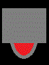

<!-- Start Writing Below in Markdown -->
Capítulo 10: A biblioteca Pygame
======

## Instalação do Pygame


### O programa abaixo usa o Pygame e descreve como se pode criar uma janela de titulo "O PyGame é fixe!"
>  Para isso crie um novo ficheiro no menu File do IDLE, seleccionando  **new window**. Escreva o código abaixo no editor do IDLE e grave com o nome fixepygame.py. Depois corra o programa premindo F5 ou seleccionando **Run > Run Module** do menu no topo do editor de ficheiros.


```python
# Importa o modulo com o pygame
import pygame_sdl2 as pygame
```


```python
# Inicia o motor de jogo
pygame.init()
```


    (5, 0)


```python
# Indica as dimensões da janela 
size=[700,500]
screen=pygame.display.set_mode(size)
```


```python
# Escreve titulo na Janela
pygame.display.set_caption("O PyGame é fixe!")
```


```python
# Usado para controlar a velocidade com que a janela é actualizada  
clock=pygame.time.Clock()
```


```python
#Para entrar em loop, até que a janela seja fechada.
done=False
```


```python
while done==False:
    for event in pygame.event.get(): # O utilizador actua na janela
        if event.type == pygame.QUIT: # Se o utilizador escolheu fechar janela
            done=True # o jogo deve terminar.

    # Actualiza a janela para esta nova composição da cena.
    pygame.display.flip()
 
    # Limita a 20 o número de frames por segundo
    clock.tick(20)

```


```python
# Para terminar o motor de jogo 
pygame.quit ()
```

O processo de carregamento e inicialização do pygame é muito simples. O pygame é uma colecção de módulos numa única biblioteca. Alguns destes módulos estão escritos em C, outros em Python. Alguns são opcionais, podendo não estar sempre presentes.

### Init - Iniciar o motor de jogo
Antes de fazer seja o que for deve iniciar o motor de jogo. A forma mais usual de o fazer é através de:

> pygame.init()

Iniciando todos os módulos por si. Nem todos os módulos necessitam ser iniciados, mas assim todos os que necessitam serão. 

### Quit - Terminar o motor de jogo
Os módulos inicializados são terminados usando o método quit().
Para a execução de um script não é obrigatório que este termine com pygame.quit(). Mas caso seja executado através do IDLE, se o script não termina os módulos do pygame, a janela gráfica não é fechada e o editor pode bloquear.

### Módulos
O Pygame tem os seguintes módulos dos quais vamos usar um número muito restrito das suas funções:

1. cdrom - Controla o acesso à unidade de cdrom devices, permitindo a reprodução de  audio.
+ cursors - Carrega imagens para o cursor do rato.
+ display - Controlo da janela gráfica.
+ draw - Permite desenhar elementos gráficos (linhas, círculos,...).
+ event - Gestão de eventos e controlo da lista de eventos.
+ font - Cria e faz o render de fontes para texto.
+ image - Carrega e grava imagens.
+ joystick - Controlo pelo joystick.
+ key - Controlo pelo teclado.
+ mouse - Controlo pelo rato.
+ movie - Reproduz ficheiro multimédia mpeg.
+ sndarray - Manipula sons com o módulo Numeric. 
+ surfarray - Manipula imagens com o  módulo Numeric.
+ time - Controlo do tempo.
+ transform - Transformações gráficas de mudança de escala, rotação, e flip.    

### pygame.draw

**pygame.draw** é o módulo do pygame para desenhar formas. Destacamos aqui alguns dos seus métodos 

> pygame.draw.rect - desenha rectângulos

> pygame.draw.rect(Surface, color, Rect, width=0): return Rect

onde **Rect** descreve uma área rectangular. O argumento **width** é a largura do traço. Caso width seja zero o rectangular é preenchido.


```python
import pygame
from random import *

white    = ( 255, 255, 255)

def desenha_fundo(screen):
    # Limpa a janela e define a cor do fundo
    screen.fill(white)
    
pygame.init()
screen = pygame.display.set_mode((640, 480))
done = False
clock=pygame.time.Clock()
while done == False:
    for event in pygame.event.get():
        if event.type == pygame.QUIT:
             done = True
                
    desenha_fundo(screen)
        
    for count in range(10):
        random_color = (randint(0,255), randint(0,255), randint(0,255))
        random_pos = (randint(0,639), randint(0,479))
        random_size = (639-randint(random_pos[0],639), 479-randint (random_pos[1],479))
        pygame.draw.rect(screen, random_color, [random_pos,random_size])
        
    pygame.display.flip()
    clock.tick(2)
pygame.quit()
```

> pygame.draw.circle - desenha um círculo centrada num ponto

> pygame.draw.circle(Surface, color, pos, radius, width=0): return Rect

O argumento pos define o centro do círculo, e radius o seu raio. O argumento width define a espessura do polígono. Caso width seja zero o polígono é preenchido.

> pygame.draw.line - desenha um segmento

> pygame.draw.line(Surface, color, start_pos, end_pos, width=1): return Rect

Os argumentos start_pos e end_pos definem o ponto inicial e final da linha.


```python
# Importa o modulo com o pygame
import pygame
 
# Definição das cores a usar
black    = (   0,   0,   0)
white    = ( 255, 255, 255)
blue     = (  50,  50, 255)
green    = (   0, 255,   0)
dkgreen  = (   0, 100,   0)
red      = ( 255,   0,   0)
purple   = (0xBF,0x0F,0xB5)
brown    = (0x55,0x33,0x00)
 
# Função para desenhar Fundo
def desenha_fundo(screen):
    # Limpa a janela e define a cor do fundo
    screen.fill(white)

# Inicia o motor de jogo
pygame.init()

# Indica as dimensões da janela 
size=[700,500]
screen=pygame.display.set_mode(size)


#Para entrar em loop, até que a janela seja fechada.
done=False

# Usado para controlar a velocidade com que a janela é actualizada  
clock=pygame.time.Clock()

while done==False:
    for event in pygame.event.get(): # O utilizador actua na janela
        if event.type == pygame.QUIT: # Se o utilizador escolheu fechar janela
            done=True # o jogo deve terminar.

    desenha_fundo(screen)

    # Determina as coordenadas do ponteiro. O resultado de pygame.mouse.get_pos()
    # é uma lista com dois elementos [x,y].
    pos = pygame.mouse.get_pos()
     
    # As coordenadas do ponteiro.
    print pos
 
    # Actualiza a janela para esta nova composição da cena.
    pygame.display.flip()
 
    # Limita a 20 o número de frames por segundo
    clock.tick(1)
pygame.quit()
```


```python
# Inicia o motor de jogo
pygame.init()

# Indica as dimensões da janela 
size=[700,500]
screen=pygame.display.set_mode(size)


#Para entrar em loop, até que a janela seja fechada.
done=False

def desenha_elemento(screen,x,y):
    pygame.draw.rect(screen,green,[0+x,0+y,30,10],0)
    pygame.draw.circle(screen,black,[15+x,5+y],7,0)
    
while done==False:
    for event in pygame.event.get(): # O utilizador actua na janela
        if event.type == pygame.QUIT: # Se o utilizador escolheu fechar janela
            done=True # o jogo deve terminar.

    desenha_fundo(screen)

    # Determina as coordenadas do ponteiro. O resultado de pygame.mouse.get_pos()
    # é uma lista com dois elementos [x,y].
    pos = pygame.mouse.get_pos()
     
    # A componente x e y das coordenadas do ponteiro.
    x=pos[0]
    y=pos[1]
     
    # Desenha elemento onde está o ponteiro.
    desenha_elemento(screen,x,y)
 
    # Actualiza a janela para esta nova composição da cena.
    pygame.display.flip()
 
    # Limita a 20 o número de frames por segundo
    clock.tick(20)

# Para terminar o motor de jogo 
pygame.quit ()
```

### pygame.mouse
Módulo do pygame que permite trabalhar com o rato. As funções descritas permitem obter o estado actual do rato, podendo alterar o cursor do sistema para o rato.    
    
Quando um ecrã é criado, a fila de eventos começa a receber os eventos gerados pelo rato. Os botões do rato geram eventos  pygame.MOUSEBUTTONDOWN e pygame.MOUSEBUTTONUP sempre que são premidos ou soltos. Estes eventos contêm um atributo que permite distinguir qual o botão que foi premido. A roda  do rato gera um evento pygame.MOUSEBUTTONDOWN sempre que for rodada. Sempre que o rato é movido este gera um evento pygame.MOUSEMOTION.   


```python
# Inicia o motor de jogo
pygame.init()

# Indica as dimensões da janela 
size=[700,500]
screen=pygame.display.set_mode(size)

def desenha_elemento(screen,x,y):
    pygame.draw.rect(screen,green,[0+x,0+y,30,10],0)
    pygame.draw.circle(screen,black,[15+x,5+y],7,0)
    
# Função para desenhar Fundo
def desenha_fundo(screen):
    # Limpa a janela e define a cor do fundo
    screen.fill(white)
    
#Para entrar em loop, até que a janela seja fechada.
done=False

while done==False:
    
    desenha_fundo(screen)
    
    for event in pygame.event.get(): # O utilizador actua na janela
        if event.type == pygame.QUIT: # Se o utilizador escolheu fechar janela
            done=True # o jogo deve terminar.
        if event.type == pygame.MOUSEMOTION:
            # A componente x e y das coordenadas do ponteiro.
            x=event.pos[0]
            y=event.pos[1]
            # Desenha elemento onde está o ponteiro.
            desenha_elemento(screen,x,y)
            
 
    # Actualiza a janela para esta nova composição da cena.
    pygame.display.flip()
 
    # Limita a 20 o número de frames por segundo
    clock.tick(20)

# Para terminar o motor de jogo 
pygame.quit ()
```

### pygame.mouse

> pygame.mouse.get_pressed - Devolve o estado dos botões do rato.

> pygame.mouse.get_pressed(): return (button1, button2, button3)

Devolve uma sequência de booleanos representando o estado de todos os botões do rato. Um valor True indica que o rato estava premido no momento em que a função foi chamada. 


> pygame.mouse.get_pos - Devolve a actual posição do cursor do rato.

> pygame.mouse.get_pos(): return (x, y)

Devolve as coordenadas do cursor do rato. Estas coordenadas são relativas ao canto superior esquerdo do ecrã. Apear de o cursor poder estar fora da janela, as suas coordenadas devolvidas por esta função são reescritas a coordenadas da janela.
        
        
> pygame.mouse.get_rel - Quantidade de movimento

> pygame.mouse.get_rel(): return (x, y)

Devolve a deslocação em x e em y desde a última chamada à função. Sendo a deslocação restrita aos vértices da janela.

> pygame.mouse.set_pos - Localiza o cursor do rato 

> pygame.mouse.set_pos([x, y]): return None

Indica a posição do rato na janela. Se o cursor do rato está visível este salta para a nova posição.

> pygame.mouse.set_visible - Esconde ou mostra o cursor

> pygame.mouse.set_visible(bool): return bool

Se o argumento é True, o cursor do rato passa a estar visível. Devolvendo o estado anterior.


### Problema 1: 
Na janela gráfica, deve ficar um circulo com centro nos pontos que selecciona com o rato.


```python
# Importa o modulo com o pygame
import pygame
 
# Definição das cores a usar
black    = (   0,   0,   0)
white    = ( 255, 255, 255)
blue     = (  50,  50, 255)
green    = (   0, 255,   0)
dkgreen  = (   0, 100,   0)
red      = ( 255,   0,   0)
purple   = (0xBF,0x0F,0xB5)
brown    = (0x55,0x33,0x00)
 
# Função para desenhar Fundo
def desenha_fundo(screen):
    # Limpa a janela e define a cor do fundo
    screen.fill(white)
 
# Desena um circulo
def desenha_elemento(screen,x,y):
    pygame.draw.circle(screen,black,[x+5,y+5],10,0)
 
# Inicia o motor de jogo
pygame.init()

# Indica as dimensões da janela 
size=[700,500]
screen=pygame.display.set_mode(size)

# Inicia lista de pontos
point_list = []

#Para entrar em loop, até que a janela seja fechada.
done=False

# Usado para controlar a velocidade com que a janela é actualizada  
clock=pygame.time.Clock()

while done==False:
    for event in pygame.event.get(): # O utilizador actua na janela
        if event.type == pygame.QUIT: # Se o utilizador escolheu fechar janela
            done=True # o jogo deve terminar.

    desenha_fundo(screen)

    # Determina as coordenadas do ponteiro. O resultado de pygame.mouse.get_pos()
    # é uma lista com dois elementos [x,y].
    pos = pygame.mouse.get_pos()
     
    # A componente x e y das coordenadas do ponteiro.
    x=pos[0]
    y=pos[1]

    mousestat= pygame.mouse.get_pressed() #teclas do rato

    # adiciona ponto à lista de pontos
    if mousestat[0]: # tecla esquerda do rato
        point_list.append((x,y))
 
    # Desenha circuloas nos pontos seleccionados.
    for (x,y) in point_list:
        desenha_elemento(screen,x,y)
 
    # Actualiza a janela para esta nova composição da cena.
    pygame.display.flip()
 
    # Limita a 20 o número de frames por segundo
    clock.tick(20)

# Para terminar o motor de jogo 
pygame.quit ()

```

### Problema 2: 
Na janela gráfica, sempre que selecciona um ponto as suas coordenadas devem ser armazenadas. Use estes pontos para traçar uma linha poligonal. Note que, ao segundo ponto seleccionado, uma linha deve ser traçada do primeiro para o segundo. Ao terceiro ponto uma linha deve ser acrescentada do segundo ponto para o terceiro ponto seleccionado, e assim sucessivamente. Use o botão direito do rato para seleccionar. 

Adicional faça com que o último arco traçado seja removido através do botão direito do rato. 


```python
# Importa o modulo com o pygame
import pygame
 
# Definição das cores a usar
black    = (   0,   0,   0)
white    = ( 255, 255, 255)
blue     = (  50,  50, 255)
green    = (   0, 255,   0)
dkgreen  = (   0, 100,   0)
red      = ( 255,   0,   0)
purple   = (0xBF,0x0F,0xB5)
brown    = (0x55,0x33,0x00)
 
# Função para desenhar Fundo
def desenha_fundo(screen):
    # Limpa a janela e define a cor do fundo
    screen.fill(white)
    
# Desenha linha
def desenha_elemento(screen,x_1,y_1,x_2,y_2):
    pygame.draw.line(screen,black,[x_1,y_1],[x_2,y_2],3)

# Inicia o motor de jogo
pygame.init()

# Indica as dimensões da janela 
size=[700,500]
screen=pygame.display.set_mode(size)

# Inicia lista de pontos
point_list = []

#Para entrar em loop, até que a janela seja fechada.
done=False

# Usado para controlar a velocidade com que a janela é actualizada  
clock=pygame.time.Clock()

while done==False:
    for event in pygame.event.get(): # O utilizador actua na janela
        if event.type == pygame.QUIT: # Se o utilizador escolheu fechar janela
            done=True # o jogo deve terminar.

    desenha_fundo(screen)

    # Determina as coordenadas do ponteiro. O resultado de pygame.mouse.get_pos()
    # é uma lista com dois elementos [x,y].
    pos = pygame.mouse.get_pos()
     
    # A componente x e y das coordenadas do ponteiro.
    x=pos[0]
    y=pos[1]

    mousestat= pygame.mouse.get_pressed() #teclas do rato

    # adiciona ponto à lista de pontos
    if mousestat[0]: # tecla esquerda do rato
        point_list.append((x,y))

    # remove ponto da lista de pontos
    if mousestat[2] and len(point_list)>0: # tecla direita do rato
        point_list.pop()
 
    # Desenha linha entre pontos.
    if len(point_list)>1:
        p_1 = point_list[0]
        for p_2 in point_list[1:]:
            (x_p_1,y_p_1)=p_1
            (x_p_2,y_p_2)=p_2
            desenha_elemento(screen,x_p_1,y_p_1,x_p_2,y_p_2)
            p_1=p_2
 
    # Actualiza a janela para esta nova composição da cena.
    pygame.display.flip()
 
    # Limita a 20 o número de frames por segundo
    clock.tick(20)

# Para terminar o motor de jogo 
pygame.quit()
```

### Uso do teclado
Os scripts apresentados tratam eventos QUIT, que é fundamental, a menos que queira janelas imortais! O pygame permite tratar outros eventos como o movimento do rato e teclas primidas.

Nos exemplos anteriores chamamos pygame.event.get() para aceder à lista dos eventos. Dando possibilidade a tratar através do ciclo for todos os eventos à sua medida.

Os objectos na lista  pygame.event.get() contêm atributos próprios que permitem descreve-los. A única coisa comum aos eventos é o seu tipo. Na lista abaixo apresentamos os diferentes tipos de eventos.

Evento | Objectivos | Parâmetros 
-------|------------|-----------
QUIT | Fecho de janela |
ACTIVEEVENT | Janela está activa ou escondida | gain, state
KEYDOWN | A tecla foi primida | unicode, key, mod
KEYUP | A tecla foi largada | pos, button
MOUSEMOTION | O rato foi movido | pos, rel, buttons 
MOUSEBUTTONDOWN | Um botão do rato foi primido | pos, button 
MOUSEBUTTONUP | Um botão foi largado | pos, button
VIDEORESIZE | A janela foi redimensionada| size, w, h 
USEREVENT | Um evento do utilizador | code 

O teclado gera eventos KEYDOWN quando uma tecla é primida e KEYUP quando uma tecla é largada. Abaixo tratamos estes eventos:


```python
-
```

### pygame.image - Módulo para transferir imagens.

O módulo contém funções para carregar e gravar imagens, bem como para transformar superfícies para formatos usados noutros módulos.

Note que, não existe um classe imagem, uma imagem é carregada como uma superfície. A classe superfície pode ser manipulada (desenhar linhas, definir pixeis, capturar regiões, etc.).

Por defeito este módulo apenas carrega imagens BMP não comprimidas. Quando definido com suporte total de imagens, a função pygame.image.load permite carregar imagens em formato:

 JPG,  PNG, GIF (não animado), BMP, PCX, TGA (não comprimido), TIF, PBM
 
Permitindo gravar imagens nos seguintes formatos BMP,TGA,PNGe JPEG.

Neste módulo só vamos recorrer  à função pygame.image.load

> pygame.image.load - Para carregar imagens a partir de um ficheiro.

> pygame.image.load(filename): return Surface
> pygame.image.load(fileobj, namehint=""): return Surface

Carrega uma imagem de um ficheiro. O argumento pode ser o nome de um ficheiro ou um objecto de tipo ficheiro.

O Pygame determina automaticamente o tipo da imagem (i.e. GIF ou bitmap) e cria uma nova superfície a partir dos dados. Em alguns casos é necessário saber a extensão do ficheiro (i.e., as imagens GIF têm extensões ".gif"). Se usar como referência à imagem um objecto de tipo ficheiro, pode ter a necessidade de definir o nome do ficheiro original como segundo argumento.
 
A superfície que é devolvida contém o mesmo formato de cores, e transparência alfa como no ficheiro que lhe deu origem. Em condições normais vai pretender chamar Surface.convert - para normalizar a estrutura que representa os pixeis.

Para transparências alfa, como nas imagens .png use o método convert_alpha() após serem carregadas por forma a definir pixeis transparentes.

Outra forma de definir a transparência numa imagem é através do método Surface.set_colorkey. Neste caso definimos a cor na superfície que deve ser assumida como transparente. Por exemplo

> jogador = pygame.image.load("jogador1.gif").convert()
> jogador.set_colorkey((255,255,255))
 
na superfície jogador é assumido que todos os pontos de cor (255,255,255) devem ser assumidos como transparentes. 

Para facilitar a compatibilidade entre plataformas (Linux, Windows,...)  deve recorrer a os.path.join(). Por exemplo

> superficie = pygame.image.load(os.path.join('data', 'blabla.png'))


Embora o carregamento de uma imagem permita a definição de uma superfície, por vezes tem-se a necessidade de definir superfícies genéricas. Geralmente, com o propósito de processar imagens ou para a criação de formas no programa. Por exemplo
 

> superficie = pygame.Surface((256, 256))

define uma superfície genérica de 256x256 de cor preta. Nestas superfícies podemos compor imagens.


```python
# pygame.font
def texto(pos,txt):     
    font = pygame.font.Font(None, 25)
    text = font.render(txt,True,black)
    screen.blit(text, pos)
```


## Exemplo: O invasor:

1. Inicie o pygame com uma janela gráfica 400x500.
+ Junta imagem de fundo (sky.jpg).

sky.jpg|
--------|
|

+ Desloque no topo da janela, da esquerda para a direita, a imagem de um OVNI (fno.png). Impondo o branco como a cor transparente. 

+ Use a metade inferior da janela para deslocar a imagem do jogador, controlada pelo rato. Estas imagens estão em play1.gif, play2.gif e play3.dif, devendo a imagem escolhida depender do movimento do rato. Devendo usar play1.gif quando o rato não está em movimento. Reservado play2.gif e play3.gif, respectivamente, para identificar  as situações onde o rato se desloca da direita para a   esquerda e da esquerda para a direita.   

play1.gif | play2.gif | play3.dif
-------|--------|--------
||

+ O jogador dispara um círculo, no sentido ascendente, sempre  que se usa o botão esquerdo do rato. Atenção: os projecteis que  não estejam visíveis devem ser removidas da estrutura auxiliar. 
+ Meta no ecrã um contador de pontos. Sempre que um projéctil intersecte o OVNI, deve incrementá-lo. 
+ Sempre que se dispara ou sempre que um projéctil intersecta o OVNI devem ser emitidos sons diferentes.   


```python
import pygame

black = [  0,  0,  0]
white = [255,255,255]
blue =  [  0,  0,255]
green = [  0,255,  0]
red =   [255,  0,  0]

pygame.init()

def texto(pos,txt):     
    font = pygame.font.Font(None, 25)
    text = font.render(txt,True,black)
    screen.blit(text, pos)
  
screen=pygame.display.set_mode([400,500]) 
pygame.display.set_caption("MDP Game - OVNI -2012/13")
 
done=False
xfno=-50     #inicia x do OVNI
yfno=50    #inicia y do OVNI

xOld=0     #inicia coordenadas 
yOld=0

pontos = 0 #inicia pontos

balas=[]

clock = pygame.time.Clock()

background = pygame.image.load("sky.jpg").convert()
fno = pygame.image.load("fno.png").convert() #imagem do OVNI
fno.set_colorkey(white) # Define Cor que se assume como transparente

jogador=[] #incia lista de imagens do utilizador
jogador.append(pygame.image.load("play1.gif").convert())
jogador.append(pygame.image.load("play2.gif").convert())
jogador.append(pygame.image.load("play3.gif").convert())

balas_sound = pygame.mixer.Sound("pickup.wav") #som da bala a sair
ponto_sound = pygame.mixer.Sound("SCREECH.wav") #som do OVNI

while done==False:
      
    for event in pygame.event.get(): 
        if event.type == pygame.QUIT: 
            done=True 
 
    screen.fill(blue)

    screen.blit(background, [0,0])

    # Rato 
    pos = pygame.mouse.get_pos() #coordenadas do rato
    
    #posição do rato
    xR=pos[0]
    yR=pos[1]

    mousestat= pygame.mouse.get_pressed() #teclas do rato


    # Jogor:
    if yR<250: # Limita yR
        yR=250
    elif yR>450:
        yR=450

    if xR<0: # Limita xR
        xR=0
    elif xR>350:
        xR=350
    
    if xR<xOld:
        screen.blit(jogador[1], [xR,yR]) #move direita
    elif xR>xOld:
        screen.blit(jogador[2], [xR,yR]) #move esquerda
    else:
        screen.blit(jogador[0], [xR,yR]) #está parado ou move na vertical


    xOld=xR #actualiza posição
    yOld=yR

    # adiciona bala na lista balas
    if mousestat[0]:
        balas.append([xR+30,yR])
        balas_sound.play()

    if xfno>450: #chega ao fim da janela
        xfno=-50
    else:
        xfno=xfno+15

    screen.blit(fno, [xfno,yfno]) #desenha OVNI

    #move bala
    newbalas=[]
    #update da posição das bolas na lista balas
    for bala in balas:
        if bala[1]>0: #bola chega ao topo da janela
            #print(newbalas)
            xB=bala[0] #coordenadas da bola
            yB=bala[1]
            pygame.draw.circle(screen,black,[xB,yB],5) #pinta bola
            if xB>xfno and xB<xfno+50 and yB>yfno and yB<yfno+30:  #bola bate no OVNI
                pygame.draw.circle(screen,red,[xB,yB],20)
                pontos=pontos+1
                ponto_sound.play()
            else:
                bala[1]= bala[1]-10 #move uma bala para cima
                newbalas.append(bala) #remove bala da lista
    balas=newbalas

    texto([50,450],'Pontos: '+str(pontos)) #imprime pontos
    
    pygame.display.flip()
    clock.tick(10)

pygame.quit ()
```

### Problema 3: 
Crie um tabuleiro de 17x17, com quadrados de 30x30 pontos, onde cada quadrado deve ter um número associado.


```python
import pygame
# inicialização do módulo pygame
pygame.init()
# criação de uma janela

#Cor
white=[255,255,255]
black=[0,0,0]

largura = 17*30
altura = 17*30

# pygame.font
def texto(screen,pos,txt):     
    font = pygame.font.Font(None, 25)
    text = font.render(txt,True,black)
    screen.blit(text, pos)

# Função para desenhar Fundo
def desenha_fundo(screen):
    # Limpa a janela e define a cor do fundo
    screen.fill(white)
    numero=1
    for linha in range(17):
        desenha_elemento(screen,0,linha*30,largura,linha*30)
        desenha_elemento(screen,linha*30,0,linha*30,altura)
        
        for coluna in range(17):
            texto(screen,(coluna*30,linha*30+5),str(numero))
            numero=numero+1

    
# Desenha linha
def desenha_elemento(screen,x_1,y_1,x_2,y_2):
    pygame.draw.line(screen,black,[x_1,y_1],[x_2,y_2],3)
    
    

tamanho = (largura, altura)
screen = pygame.display.set_mode(tamanho)

#Para entrar em loop, até que a janela seja fechada.
done=False

# Usado para controlar a velocidade com que a janela é actualizada  
clock=pygame.time.Clock()

while done==False:
    for event in pygame.event.get(): # O utilizador actua na janela
        if event.type == pygame.QUIT: # Se o utilizador escolheu fechar janela
            done=True # o jogo deve terminar.
        if event.type == pygame.KEYDOWN:
            if   event.key == pygame.K_LEFT:
                move_x = -1
            elif event.key == pygame.K_RIGHT:
                move_x = +1
            elif event.key == pygame.K_UP:
                move_y = -1
            elif event.key == pygame.K_DOWN:
                move_y = +1
                
    desenha_fundo(screen)

 
    # Actualiza a janela para esta nova composição da cena.
    pygame.display.flip()
 
    # Limita a 20 o número de frames por segundo
    clock.tick(20)

# Para terminar o motor de jogo 
pygame.quit()
```

### Problema 4: 
Controle uma peça usando as teclas do cursor. Sempre que é pressionada  uma tecla o jogador deve ser movido no tabuleiro uma posição na horizontal ou vertical. Sempre que usa uma tecla o jogador fica virado na direcção seleccionada, representada pela imagem play1.gif, play2.gif ou play3.gif. 


```python
import pygame
# inicialização do módulo pygame
pygame.init()
# criação de uma janela

#Cor
white=[255,255,255]
black=[0,0,0]

largura = 17*30
altura = 17*30

# pygame.font
def texto(screen,pos,txt):     
    font = pygame.font.Font(None, 25)
    text = font.render(txt,True,black)
    screen.blit(text, pos)

# Função para desenhar Fundo
def desenha_fundo(screen):
    # Limpa a janela e define a cor do fundo
    screen.fill(white)
    numero=1
    for linha in range(17):
        desenha_elemento(screen,0,linha*30,largura,linha*30)
        desenha_elemento(screen,linha*30,0,linha*30,altura)
        
        for coluna in range(17):
            texto(screen,(coluna*30,linha*30+5),str(numero))
            numero=numero+1

    
# Desenha linha
def desenha_elemento(screen,x_1,y_1,x_2,y_2):
    pygame.draw.line(screen,black,[x_1,y_1],[x_2,y_2],3)
    
    
jogador=[] #incia lista de imagens do utilizador
jogador.append(pygame.image.load("play1.gif").convert())
jogador.append(pygame.image.load("play2.gif").convert())
jogador.append(pygame.image.load("play3.gif").convert())

tamanho = (largura, altura)
screen = pygame.display.set_mode(tamanho)

#Para entrar em loop, até que a janela seja fechada.
done=False

# Usado para controlar a velocidade com que a janela é actualizada  
clock=pygame.time.Clock()

move_coluna=0
move_linha=0

pos_x=100
pos_y=100

while done==False:
    for event in pygame.event.get(): # O utilizador actua na janela
        if event.type == pygame.QUIT: # Se o utilizador escolheu fechar janela
            done=True # o jogo deve terminar.
        if event.type == pygame.KEYDOWN:
            if   event.key == pygame.K_LEFT:
                move_coluna = -1
            elif event.key == pygame.K_RIGHT:
                move_coluna = +1
            elif event.key == pygame.K_UP:
                move_linha = -1
            elif event.key == pygame.K_DOWN:
                move_linha = +1
                
    desenha_fundo(screen)

    pos_x=pos_x+move_coluna*10
    pos_y=pos_y+move_linha*10
    
    screen.blit(jogador[0], (pos_x,pos_y))
    
    # Actualiza a janela para esta nova composição da cena.
    pygame.display.flip()
 
    # Limita a 20 o número de frames por segundo
    clock.tick(20)

# Para terminar o motor de jogo 
pygame.quit()
```


    ---------------------------------------------------------------------------

    error                                     Traceback (most recent call last)

    <ipython-input-24-910a2f7f9deb> in <module>()
         37 
         38 jogador=[] #incia lista de imagens do utilizador
    ---> 39 jogador.append(pygame.image.load("play1.gif").convert())
         40 jogador.append(pygame.image.load("play2.gif").convert())
         41 jogador.append(pygame.image.load("play3.gif").convert())


    error: No video mode has been set


```python
# aula 08 - pygame
# importar o módulo pygame
# se a execução deste import em python 3 der algum erro é porque o pygame
# não está bem instalado
import pygame
# inicialização do módulo pygame
pygame.init()
# criação de uma janela
largura = 600
altura = 400
tamanho = (largura, altura)
janela = pygame.display.set_mode(tamanho)

# número de imagens por segundo
frame_rate = 10
# relógio para controlo do frame rate
clock = pygame.time.Clock()
# nova imagem a mostrar
nova_frame = None
# cor de fundo (tuplo com os valores Red, Green, Blue entre 0 e 255)
RED = (255, 0, 0)

# número da frame
numero = 0
# posicao do número da frame
posicao_numero_x = int(largura/2)
posicao_numero_y = int(altura/2)
# tipo de letra do número da frame
# tamanho
font_size = 25
# fonte pré-definida
font = pygame.font.Font(None, font_size)
# suavização
antialias = True
# cor (tuplo com os valores Red, Green, Blue entre 0 e 255)
WHITE = (255, 255, 255)
# ler uma imagem em formato bmp
isel_surface = pygame.image.load("fno.png").convert()
# variável de controlo do ciclo principal
fim = False
# função de processamento de eventos pygame

def processar_eventos_pygame():
    global fim
    global numero
    global posicao_numero_x
    global posicao_numero_y

    # ciclo para processar os eventos pygame
    for event in pygame.event.get():
        # evento fechar a janela gráfica
        if event.type == pygame.QUIT:
            fim = True
        # evento mouse click botão esquerdo (código = 1)
        elif event.type == pygame.MOUSEBUTTONUP and event.button == 1:
            (x, y) = event.pos
            numero = 0
            posicao_numero_x = x
            posicao_numero_y = y
            # evento teclas setas
        elif event.type == pygame.KEYDOWN:
            if event.key == pygame.K_LEFT:
                posicao_numero_x = posicao_numero_x - 10
            elif event.key == pygame.K_RIGHT:
                posicao_numero_x = posicao_numero_x + 10
            elif event.key == pygame.K_UP:
                posicao_numero_y = posicao_numero_y - 10
            elif event.key == pygame.K_DOWN:
                posicao_numero_y = posicao_numero_y + 10

# função para construção de uma nova frame de raíz. Não é usada
# nehuma informação gráfica da frame anterior.
def construir_nova_frame():
    
    global nova_frame
    
    # criar uma nova frame
    nova_frame = pygame.Surface(tamanho)
    
    # cor de fundo
    nova_frame.fill(RED)
    
    # inserir uma imagem
    nova_frame.blit(isel_surface, (0, 0))
    
    # inserir o número da frame
    numero_surface = font.render(str(numero), antialias, WHITE)
    
    nova_frame.blit(numero_surface, (posicao_numero_x, posicao_numero_y))

# ciclo principal
while not(fim):
    
    processar_eventos_pygame()
    
    construir_nova_frame()
    
    # actualizar pygame com a nova imagem
    janela.blit(nova_frame, (0, 0))
    
    pygame.display.flip()
    
    # esperar o tempo necessário para cumprir o frame rate
    # só deve ser chamado uma vez por frame
    clock.tick(frame_rate)
    
    # actualizar numero da frame
    numero = numero + 1
    
# fechar a janela. pygame.quit() só é necessário
# quando o programa é executado a partir do IDLE
# uma referêncoa para a janela aberta e sem esta
# janela não fecha quando o programa termina. Só
# termina).
pygame.quit()
```


```python

```
