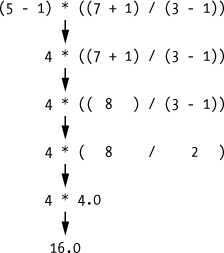

Matemática Discreta para Hackers
=====

##### Version 0.1
Bem vindo a  *Matemática Discreta para Hackers*. O repositório Github está desponivel em [github/Matematica-Discreta-e-Programacao-Usando-Python](https://github.com/MelroLeandro/Matematica-Discreta-para-Hackers). Esperamos que goste deste livro, e encorajamos que contribuira na sua melhoria!

Capítulo 1
======
***

Python
------

A linguagem de programação Python é constituida por diferenres construções sintácticas, uma grande variedade de funções em bibliotecas e estructuras de dados standard à linguagem. Formalmente podemos ignorar grande parte destes atributos, para o tipo de aplicações que temos em mente. Pretendemos implementar simples funções ou pequenos programas com o proposito de resolver problemas de matemática discreta e ensentivar o seu estudo mais aprefundado. A complexidade dos problemas seram incrementadas progrecivamente ao longo dos Capítulos. O que inicialmente são pequenos scripts, com meia duzia de linhas de programação, nos últimos Capítulos do livro vai exigir a utilização de vários módulos descitos em ficeiros separados. Nesse sentido, a parte inicial, ou nos capítulos iniciais, a execução das linhas de comando faz-se no Jupyter ou directamente no interpretagor. Na parte final deste Notebook, passa a ser esegida a utilização dum editor de texto ou de um ambiente de programação. Aqui usamos o IDLE que apesar das suas limitações é usado aqui como ambiente de desenvolvimento standard.

Temos no entanto de aprender alguns conceitos de programação básicos antes de podermos resolver qualquer problema. Os exemplos de utilização seram apresentados após apresentação de um enquadramento teórico, nos Capítulos consecuentes.

Em todos estes Capítulos encorajamos a que os exemplos apresentados sejam alterados e executados no Jupyter e se possivel reescritos directamente no interpretador ou ambiente de desenvolvimento. Neste ponto assumimos que tem o ambiente Jupyter a funcionar no seu computador.   

#### Fundamentos

O espaço abaixo é usual designar no Jupyter célula de execução:


```python

```

Neste caso a célula está vazia. Com isto quer dizer que não tem código ou programa para ser executado. Para executar uma célula basta que esta esteja selecionada e seja teclado simultaniamente Shift+Return.

Podemos começar por usar uma célula para fazer um pouco de aritmética.


```python
2+2
```


    4


Resumino: o resultado de avaliar 2+2 é 4. Fantástico. Exprimente alteras o operador usando para isso a sintaxe descrita abaixo.

Operador |  Operação | Examplemplo | Valor ...
---------|-----------|-------------|-----------
**       | potência  | 2 ** 3      | 8
%        | resto da divisão inteira | 22 % 8 |6
//       | quociente da divisão inteira | 22 // 8 | 2
/       | divisão |  22 / 8 | 2.75
*  | multiplicação |  3 * 5 |15
-  | Subtraction |  5 - 2 | 3
+  | Addition  | 2 + 2 | 4

A ordem das operações (também designada de precedência) dos operadores aritméticos do Pythone é similar à que é usada na matemática. O operador ** é avaliado primeiro; os operadores  *, /, //, e % são avaliados a seguir, da esquerda para a direita; por último é avaliado + e - (também da esquerda para a direita). Naturalmente que podemos usar parenteses para superimpor a ordem de avaliação que desejar.


```python
(5 - 1) * ((7 + 1) / (3 - 1))
```


    16


Na tentativa de avaliar uma expressão, como a anterir, o Python, guiado pela ordem de precedencia imposta pelos operadores ou pela parentização, avalia progrecivamente subfórmulas até opter um valor único.



As regras usadas para formar expressões que podem ser avaliadas ( ou que o interpretador de Python perceba) são parte fundamental do Python como linguagem de programação. Estas regras podem ser entendidas como identicas às regras gramaticais que nos ajudam a comunicar.

Sempre que pedimos ao Python para executar uma instrução desconhecida, ou cuja descição é incorrecta ou que o Python não consegue preceber, é emitida uma mensagem identificando um erro de sintaxe:


```python
5+
```


      File "<ipython-input-3-bc8c986ea5b3>", line 1
        5+
          ^
    SyntaxError: invalid syntax


```python
42 + 5 + * 2
```


    -8


Acima são apresentados dois exemplos de expressões que não respeitam as regras gramaticais da linguagem de programação.

##### Constantes Literais
Um exemplo de uma constante literal é um número como *5*, *1.23*, *9.25e-3* ou uma string (sequência de caracteres) como *'Isto é uma string'* ou *"É uma string!"*. Estas constantes são designadas literais porque devem ser interpretadas à letra (literalmente). O número *2* é entendido como dois, é uma constante porque o seu valor (significado) não pode ser alterado. 

##### Números

Os números em Python são de três tipos: *inteiros*, *ponto flutuante* e *complexos*:

1. *2* é um exemplo de inteiro, os inteiros são elementos do conjunto dos números inteiros. Existem no entanto limitações à magnitude dos inteiros que se podem usar. 

    2. *3.23* e *52.3E-4* são exemplos de números no sistema de virgula flutuante (ou floats, para abreviar). A notação E indica as potências de *10*. Neste caso, *52.3E-4* significa *52.3*$\times$ *10*$^{-4}$.

3. (*-5+4j*) e (*2.3 - 4.6j*) são exemplos de números complexos, que em Matemáica é normal representar por *-5+4i* e *2.3 - 4.6i*.

##### Strings

[caracteres]

Uma string é uma sequência de caracteres. As strings são basicamente uma sequência de símbolos. As stings são usualmente usadas para representar palavras que podem ser da língua Inglesa ou de qualquer língua que seja suportada pelo padrão Unicode (permitindo codificar quase todas as línguas do mundo). 

##### Aspas Unitárias
Uma strings pode ser definida por uma sequência de caracteres delimitada por aspas unitárias (ou apóstrofes) tais como *'O estudo da lógica remonta à civilização helénica'*. Todos os espaços em branco, isto é, espaços e tabulações são preservados no estado em que se encontram.

##### Aspas Duplas
As strings podem ser também definidas usando aspas duplas por exemplo : *"A arte da argumentação levou à morte de Sócrates."*

##### Aspas Triplas
Outra forma a definir strings que ocupam várias linhas é usar aspas triplas (""" ou '''). Um exemplo:

>    '''A palavra "trivial" tem uma etimologia interessante. 
   É a conjugação de "tri" (significando '3') e "via" (significando caminho).
   Originalmente refere-se ao "trivium", as três áreas fundamentais do
   'curriculae': gramática, retórica e lógica.
   Assuntos que se tem de dominar para aceder ao "quadrivium", que
   consiste na aritmética, geometria, música e astronomia.      
    '''
    
##### Sequências de Escape
Para definir uma string que contenha um apóstrofe ('), como em: 

>'Why was logic considered to be fundamental to one's education?' 

sem que a apóstrofe interna entre em conflito com os delimitadores, usa-se uma sequência de escape. Para evitar o conflito, o caracter apóstrofe é representado na string por $\setminus$'. A string deve assim ser definida como:

>'Why was logic considered to be fundamental to one$\setminus$'s education?'

Outra forma de definir a string anterior seria \emph{"Why was logic considered to be fundamental to one$\setminus$'s education?"}, através das aspas duplas. De forma idêntica, é usada uma sequência de escape para inserir aspas duplas numa string limitada por aspas duplas. A própria barra invertida pode ser inserida na string pela sequência de escape $\setminus\setminus$.

Como apresentado para definir uma string com mais de duas linhas usa-se por limitador aspas triplas. Outro processo é usar uma sequência de escape $\setminus$n, para indicar o fim de uma linha e o início de outra linha na string. Por exemplo, 

> 'A lógica centra-se na razão e na noção de verdade.$\setminus$n A retórica fundamenta-se em ideias feitas e populistas.'

Existem outras sequências de escape, apresenta-se aqui apenas as mais usadas. Para um descrição sistemática use a documentação do interpretador.

Num editor, durante a programação, é frequente ter a necessidade de continuar uma string na linha imediatamente abaixo. Para isso é usada uma única barra invertida no fim da linha. Por exemplo em *Looking Glass* de Lewis Carroll:


```python
H=   "\"Reciprocamente\", continuou Tweedledee, \
\"Se é assim, ele pode ser, \n \
e se não é, será; mas como não é não se preocupa. \
Isto é lógica.\" "
print(H) 
```

    "Reciprocamente", continuou Tweedledee, "Se é assim, ele pode ser, 
     e se não é, será; mas como não é não se preocupa. Isto é lógica." 


Se por algum motivo tem necessidade que o interpretador não trate as sequências de escape, na definição da string deve usar como prefixo um r ou um R. Por exemplo, na string anterior:


```python
H=  r"\"Reciprocamente\", continuou Tweedledee, \
\"Se é assim, ele pode ser, \n \
e se não é, será; mas como não é não se preocupa. \
Isto é lógica.\" "
print(H)
```

    \"Reciprocamente\", continuou Tweedledee, \"Se é assim, ele pode ser, \n e se não é, será; mas como não é não se preocupa. Isto é lógica.\" 


#### As strings são Imutáveis
[unicode: descrição e exemplos]

[seria mais lógico iniciar o estudo com listas, tuplos diferença entre estruturas mutáveis e imotáveis]
Isso significa que, como constantes literais, uma vez definida uma string, esta não pode sofrer alterações. 

#### Concatenação de Literais do Tipo String

Quando numa linha de código duas strings são postas lado a lado, o interpretador faz a sua concatenação. Por exemplo:


```python
H='Originalmente' ' a lógica lidava' ' com linguagem natural'
print(H)
```

    Originalmente a lógica lidava com linguagem natural


De forma mais descritiva pode-se recorrer ao operador +:


```python
H='Seria útil'+' demonstrar a correcção'+' dum argumento.'
print(H)
```

    Seria útil demonstrar a correcção dum argumento.


### Variáveis
As variáveis podem ser usadas para referenciar literais, por forma a permitir o seu tratamento e manipulação.  De forma genérica, uma  variável pode ser entendida como uma referência a uma parte da memória do computador onde está armazenada informação. Diferindo das constantes literais, uma vez que o seu significado pode variar no decurso do programa.


```python
H1 = 'Seria útil '
H2 = 'demonstrar a correcção '
H3 = 'dum argumento.'
print(H1+H2+H3)
```

    Seria útil demonstrar a correcção dum argumento.


No exemplo H1, H2 e H3 são usadas para identificar três strings, cuja concatenação é imprimida na *shell* través do comando *print*.

As variáveis são entendidas como identificadores. Entendendo-se por identificador um nome dado para identificar um objecto. Existem regras para descrever os identificadores:

- O primeiro caracter do identificador tem de ser uma letra do alfabeto (maiúsculo ASCII ou minúsculo ASCII) ou um *'\_'*.
-  O resto do nome do identificador pode consistir de letras (maiúsculo ASCII ou minúsculo ASCII), *'\_'* ou dígitos (0-9).
- Nomes de identificadores são \textit{case-sensitive}. Por exemplo, myname e myName são identificadores diferentes. 

Exemplos de nomes de identificadores válidos são *i*, *\_\_my\_name*, *name\_23* e *a1b2\_c3*.  Exemplos de nomes de identificadores inválidos são *2things* e *my-name*.


```python

i = 5
print(i) 

i = i + 1
print(i)

s = '''Esta é uma string de múltiplas linhas.
Esta é a segunda linha.'''
print(s)
```

    5
    6
    Esta é uma string de múltiplas linhas.
    Esta é a segunda linha.


No programa começamos por atribuir o valor constante literal *5* à variável *i* através do *operador de atribuição* (=). Uma linha deste tipo é designada de instrução, e indica neste caso, que passámos a referenciar através do nome da variável *i* o objecto *5*. Em seguida, imprime-se o valor de *i* através do comando *print*, que imprime o valor da variável na *shell*.

Na instrução seguinte somamos *1* ao valor referenciado por *i*. A partir deste momento *i* passa a referenciar o objecto *6*. Em seguida, imprime-se o valor de *i*, agora *6*.

Como já se tinha feito na secção anterior, de forma análoga referencia-se um objecto *string*  pela variável *s*, que depois se imprime. 

#### Linhas Lógicas e Físicas

As linhas físicas são aquelas que escrevemos num editor a quando  da definição dum programa. Uma linha lógica é a que o interpretador de Python entende por uma única instrução. O Python implicitamente assume que cada linha física corresponde a uma linha lógica.

Um exemplo de uma linha lógica é uma instrução como print('Sócrates é mortal') caso esteja escrita no editor numa única linha, deve também ser entendida como uma linha física.

Implicitamente, Python incentiva o uso de uma única instrução por linha, com o propósito de tornar o código mais legível.

Se pretende definir mais do que uma linha lógica numa única linha física, então deve separar as linhas lógicas através de um ponto-e-virgula (';') para indicar o fim de cada linha lógica ou instrução. Por exemplo, 


```python
i = 5
print(i)
```

    5


é o mesmo que 


```python
i = 5; print(i)
```

    5


Voltando a um exemplo anterior:


```python
H=   "\"Reciprocamente\", continuou Tweedledee, \
\"Se é assim, ele pode ser, \n \
e se não é, será; mas como não é não se preocupa. \
Isto é lógica.\" "
print(H)
```

    "Reciprocamente", continuou Tweedledee, "Se é assim, ele pode ser, 
     e se não é, será; mas como não é não se preocupa. Isto é lógica." 


O objecto string que passa a ser referenciado por *H* deve ser entendido como definido numa única linha lógica, apesar de ocupar diferentes linhas físicas.  

Neste sentido usa-se ; (ponto-e-virgula) para separar linhas lógicas na mesma linha física, enquanto $\setminus$ para separar uma linha lógica em diferentes linhas físicas.

### Identação

Os espaços em  branco são muito importantes no Python. Na verdade, os espaços brancos no início de uma linha definem a estrutura do programa. Nesta situação são designados de identação. Os espaços ou tabulações no início de uma linha determinam o nível de identação de uma linha lógica, que por sua vez agrupam instruções. Significando isto que linhas com o mesmo nível de identação são executadas em sequência. Estes conjuntos de instruções são designados blocos. Tenta-se ao longo do texto descrever a importância dos blocos.  

Note que, má identação pode originar erros a quando da execução. Por exemplo:


```python
i = 5
 print('São ', i) # Erro! Existe um espaço no início da linha
print('São,',i,' os macacos.')
```


      File "<ipython-input-56-cafa8a948aa6>", line 2
        print('São ', i) # Erro! Existe um espaço no início da linha
        ^
    IndentationError: unexpected indent


Note-se que, existe um espaço simples no início da segunda linha. O erro indica que a sintaxe do programa está incorrecta, ou seja, o programa não está escrito com a estrutura correcta. Não podemos iniciar novos blocos de instruções arbitrariamente (com excepção do inicial). Os casos onde se podem usar novos blocos são apresentados ao longo do capítulo.

#### Como identar

Não misturar tabulações com espaços a quando da identação, já que nem todas as plataformas a suportam. É recomendado o uso de uma tabulação, ou dois espaços ou quatro espaços para distinguir cada nível de identação. Escolha um destes estilos de identação. Mais importante que a escolha que faz, deve manter-se consistente a ela, ou seja, mantenha apenas um tipo de identação ao longo de todo o código. 

### Operadores e Expressões

#### Introdução
A maioria das instruções (linhas lógicas) que escreve contêm expressões. Um exemplo simples de uma expressão é 2+3. Uma expressão pode ser partida em operador e operandos. Os operadores são funções que podem ser identificadas por símbolos, como +, ou palavras especiais.
Os operadores requerem argumentos, que chamamos de operandos. No exemplo anterior, 2 e 3 são operandos.

#### Operandos
Uma expressão pode ser avaliada no operador interactivamente.

Por exemplo, para testar a expressão 2+3, usamos a \textit{prompt} do interpretador de Python:


```python
2+3
```


```python
3*5
```


Operador  |    Nome     |     Explicação
----------|-------------|---------------------
+         | Adição      | Soma dois objectos
-         | Subtracção  | Define um número negativo ou a subtracção de um número por outro
*         | Multiplicação|  Devolve o produto de dois números ou uma string repetida uma certa quantidade de vezes
\**        | Potência | Retorna x elevado à potência de y
/          | Divisão  | Divide x por y
//         | Divisão Inteira | Devolve a parte inteira do quociente
\% | Modulo| Devolve o resto da divisão inteira
< | Menor que | Compara x a y. Devolvendo True(verdadeiro) se x é menor que y, e False(falso) caso contrário
\> | Maior que | Devolvendo True se x é maior que y, e False caso contrário.
<= | Menor ou igual a | Devolvendo True se x é menor ou igual a y, e False caso contrário.
\>= | Maior ou igual a | Devolvendo True se x é maior ou igual a y, e False caso contrário.
== | Igual a | Avalia se os objectos são iguais
!= | Diferente de | Avalia se os objectos são diferentes
not | Operador booleano NOT | Se x é True, devolve False. Se x é False, ele devolve True.
and | Operador booleano AND | x and y devolve False se x é False, senão devolve a avaliação de y.
or | Operador booleano OR |	Se x é True, devolve True, senão devolve a avaliação de y.

### Controlo do fluxo de programas

Os programas que vimos até aqui, são descritos por uma série de declarações e o interpretador de Python executa-as seguindo uma ordem estipulada. Como alterar o fluxo execução? Por exemplo, se pretende que o programa tome algumas decisões e faça diferentes coisas dependendo das diferentes situações, como imprimir 'Bom Dia' ou 'Boa Tarde' dependendo da hora do dia.

Isto é consumado usando as instruções de controle de fluxo no Python *if*, *for* e *while*, permitindo executar um ou mais blocos de instruções apenas ou enquanto uma condição for verdadeira.

#### Blocos controlados por um *if*
A instrução *if* é usada para avaliar uma condição e se a condição é verdadeira, é executado um bloco de instruções (a que chamamos de *bloco-if* (*if-block*)), senão é executado outro bloco de instruções (a que chamamos de *bloco-else* (*else-block*)). A cláusula *else* é opcional. 


```python
#!/usr/bin/python
# Nome do ficheiro: if.py

number = 23
guess = int(input('Qual é o número inteiro? '))

if guess == number:
    print('Parabéns, você acertou.') # Novo bloco começa aqui
    print('Tenha um bom dia...') # Novo bloco termina aqui
elif guess < number:
    print('Não, é maior que isso.')  # Outro bloco
    # O bloco pode conter uma ou mais linhas ...
else:
    print('Não, é menor que isso.')

print('Adeus.') 
# Esta última instrução é sempre executada, depois da instrução if 
# ser executada
```

Neste programa, é inquirido o utilizador por um número inteiro e é verificado se este é igual a um número escondido. Usa-se uma variável *number* para referenciar o inteiro a adivinhar, neste caso *number = 23*. O utilizador tem apenas uma tentativa para adivinhar o número. A hipótese do utilizador é feita através da função *input()*. Uma função é entendida aqui como um módulo ou bloco de código reutilizável. 

A função *input()*, cria uma *prompt* com o argumento da função na shell, e espera que o utilizador escreva uma cadeia de caracteres (*string*).  A *string* que o utilizador fornece é usada como valor de saída da função. A função *int()*, converte essa *string* para um inteiro, passado a ser referenciado pela variável *guess*. Genericamente a função *int()* permite, sempre que possível, converter objectos para *string*. Neste caso é usada para converter uma cadeia de caracteres para um inteiro.

Em seguida, é comparado o inteiro referenciado pela variável *guess* com o número referenciado por *number*. Se eles forem iguais, imprime-se uma mensagem a felicitar o utilizador. Note que são utilizados níveis de identação para informar o interpretador de Python que a sequência de instruções pertence a um bloco. 

Note que a linha da instrução *if* termina com ``dois pontos'' indicando que a seguir há um bloco de instruções.

Caso a tentativa do utilizador seja menor que o número referenciado pela variável *number*, informa-se que tente na próxima execução  um número maior que o número da presente tentativa. Usa-se aqui uma cláusula *elif* para reduz a quantidade de identações requeridas.

Note-se que as linhas das instruções *elif* e *else* também terminam com ``dois pontos'', sendo seguidas pelo seu bloco de instruções que controlam.

Devemos realçar que as partes *elif* e *else* são opcionais. Uma instrução *if* mínima válida assume a forma: 


```python
if True:
    print('Sim, é verdade')   
```

Após ser executada a instrução *if*, *elif* e *else* que lhe estão associadas, a execução passa para o próximo bloco de instruções. Neste caso, volta ao  bloco principal onde encontra a instrução *print 'Adeus.'*. Após executar esta linha de código, o interpretador termina a execução do código. 

Na verdade, não é muito prático ter de executar o programa sempre que se quer fazer uma nova tentativa. Tentemos resolver o problema.

#### Ciclos *while*

A instrução *while* permite executar repetidamente um bloco de instruções, enquanto uma condição for verdadeira. Uma instrução *while* pode ter uma cláusula *else* opcional.


```python
#!/usr/bin/python
# Nome do ficheiro: while.py

number = 23
running = True

while running:
    guess = int(input('Qual é o número inteiro?')

    if guess == number:
        print('Parabéns, você acertou.') 
        running = False # Isto faz o loop while parar
    elif guess < number:
        print('Não, é maior que isso.')  
    else:
        print('Não, é menor que isso.')
else:
    print('O loop while terminou.')
    
print('Adeus.')
```

Neste programa, melhorámos o jogo anterior, tendo a vantagem de se poder fazer várias tentativas na mesma execução, terminando apenas quando se acerta no número. Tenta-se assim exemplificar o uso do ciclo *while*.

Neste código a função *input* e o bloco *if*, do programa anterior formam um bloco controlado pelo *while*. É adicionada, antes do bloco *while*, uma nova variável *unning*, que é iniciada como referenciando o valor de verdade *True*. Como a condição que controla o *while* é verdadeira, o bloco controlado pelo *while* é executado. Após a execução deste bloco de instruções, a condição é novamente avaliada. Se *running* continua a referenciar verdade, o bloco while volta a ser executado, caso contrário, se *running* passa a  referenciar falso, a execução passa para o bloco opcional *else*, findo o qual passa a executar instruções no bloco principal.

Neste sentido, o bloco *else* é executado quando a condição que controla o *while* se torna *False* que pode acontecer na primeira avaliação da condição. Se existir uma cláusula *else* no ciclo *while*, este é sempre executado a menos que o ciclo *while* nunca termine.

Os valores *True* (verdadeiro) e *False* (falso) são designados de objectos de tipo Booleano ou valores de verdade.

Note-se que, um bloco else num ciclo *while* é redundante, já que se este bloco for usado no bloco anterior ao do *while* o programa tem o mesmo comportamento.


#### Ciclo *for*

A instrução *for <var> in <objecto>* permite impor a execução cíclica de um conjunto de instruções, por exemplo, executa o bloco para cada item numa sequência. 


```python
#!/usr/bin/python
# Nome do ficheiro: for.py

for i in range(1, 5):
    print i
else:
    print('O ciclo terminou.')
```

Neste programa, imprime-se uma sequência de números. A sequência de objectos a imprimir é gerada através da função interna *range*.

A função *range*, possibilita a utilização de dois argumentos numéricos, devolvendo uma sequência de números tendo início no primeiro argumento, que incrementa sucessivamente uma unidade, terminando antes de alcançar o segundo. No exemplo, usa-se *range(1,5)* originando a sequência [1, 2, 3, 4]. O incremento desta função entre cada objecto na lista pode ser controlado usando um terceiro argumento.  Por exemplo, *range(1,5,2)* devolve uma referência para o objecto [1,3]. Note-se que na função *range* o segundo argumento funciona como limite da sequência, nunca sendo alcançado.

No ciclo *for i in range(1,5)* é equivalente a *for i in [1, 2, 3, 4]* em cada execução do bloco de instruções que controla *i*, assume valores diferentes, um por cada valor na lista *[1, 2, 3, 4]*. Na primeira execução i referencia o inteiro 1, na segunda execução i referencia o inteiro 2, na terceira execução i referencia o inteiro 3 e na quarta execução i referencia o inteiro 4. Em cada uma destas execuções imprimimos o valor de i, sendo este bloco executado 4 e apenas quatro vezes, tantas vezes quanto o número de objectos que definem a lista. Findo o qual imprime ``O ciclo terminou''.    

Lembre-se que a parte else é opcional. Quando incluída, ela será sempre executada uma vez após o ciclo for ter terminado, a não ser que uma instrução *break* seja encontrada.

Devemos notar que o ciclo ``for <var> in <objecto>'', pode iterar em qualquer objecto iterável. Aqui temos uma lista de números, em geral, podemos usar por exemplo objectos do tipo tuplo, conjunto, string ou lista genérica.


#### A instrução *break*
A instrução *break* é usada para impedir a continuação da execução dum ciclo. Permitindo por exemplo terminar um ciclo *while* sem que a condição que a controla se torne falsa.

Deve no entanto notar que quando usada em ciclos *for* ou *while*, os correspondentes bloco *else* não são executados.


```python
#!/usr/bin/python
# Nome do ficheiro: break.py

while True:
    s = input('Diga alguma coisa: ')
    if s == 'vai dar uma volta':
        break
    print('Hoje não está muito comunicativo.')
    print('Escreveu', len(s),' caracteres.')
print('Então adeus ;-(')
```

Neste programa, a cada entrada de valores o programa imprime "Hoje não está muito comunicativo.", indicando de seguida o número de caracteres usados. Sendo o comportamento alterado sempre que escrever "vai dar uma volta". Neste caso o ciclo termina executando *break*, voltando ao bloco principal, imprime "Então adeus ;-(" e termina o programa.

O tamanho duma string é determinada através da função interna *len*.

Lembre-se que a instrução *break* pode também ser usada com o ciclos *for*. No entanto, apesar desta instrução facilitar a implementação de certos algoritmos, vamos tentar aqui evitar a sua utilização.  


## Exercícios de Python

##### Exercício:
Escreva a função abaixo a função:

    def mod3(n):
        return n % 3

e execute-a para diferentes argumentos inteiros. Qual a interpretação para o operador % em Python? Qual o comportamento da função para números negativos?


```python
def mod3(n):
    return n % 3
```


```python
mod3(3)
```


    0


##### Exercício:
Defina a função incrementaUmaUnidade, que tenha por argumento $x$ e devolva $x+1$. Teste a sua função para $x=3$, $x=5$ e $x=1.5$.


```python

```


```python

```

##### Exercício:
Defina a função somaDe1AteN(n), que devolve $1+2+\ldots+n$ usando a fórmula $1+2+\ldots+n=\frac{n(n+1)}{2}$. Teste a função para vários valores de $n$.

##### Exercício:
Defina a função inverso(x), que devolve $1/x$. Aplique a função para $x=0$. Como é que o Python trata o domínio natural duma função?\label{inverso}

##### Exercício:
Assumindo definida a função duplica(x), que devolve $2x$, e a função incrementaUmaUnidade(x), dum exercício anterior. Qual é o resultado de duplica(incrementaUmaUnidade(6))? Qual é o resultado de incrementaUmaUnidade(duplica(6))}? Explique esses resultados.

##### Exercício:
Tente executar incrementaUmaUnidade, dum exercício anterior com argumento '123'. Podemos adicionar um número a uma string em Python?

##### Exercício:
Tente executar duplica, dum exercício anterior com argumento '123'. Qual o comportamento do operador $\ast$ quando tem por operandos um inteiro e uma string?

##### Exercício:
No Python, se s é uma string, s[0] identifica o primeiro caracter. Defina e teste uma função que quando aplicada a uma string devolva o seu primeiro caracter.

##### Exercício:
No Python, [a, b, c, $\ldots$, x] representa uma lista de objectos. Por exemplo [1, 5, 2] representa a lista com três números: 1, 5 e 2. Qual é o comportamento da função dum exercício anterior quando tem por argumento uma lista?

##### Exercício:
Qual o resultado de aplicar as funções $sum$, $min$ e $max$ (funções pré-definidas) a uma lista de números?

##### Exercício:
Qual o resultado de executar $min(range(n))$ e $max(range(n))$, quando $n$ é um inteiro positivo?

##### Exercício:
Reescreva a função somaDe1AteN do exercício anterior por forma a usar funções apresentadas nos exercícios \ref{sum} e \ref{range}.

##### Exercício:
Explique o resultado da execução de 2+-2 e 2++2.


```python
2+-2
```


    0


```python
2++2
```


    4


##### Exercício:
Experimente 2+++2. Explique o resultado.


```python

```

##### Exercício:
Experimente 2**3 e 2**4. Descreva o comportamento do operador **.


```python

```

##### Exercício:
Experimente "abc" + "def" e 'abc' + 'def'. Descreva o comportamento do operador + quando aplicado a strings.


```python

```

##### Exercício:
O operador * pode ser aplicado a strings? Experimente $3\ast$'12' e explique o resultado.


```python

```

##### Exercício:
Execute 9-8*2+6 e (5-1)*(1+2)**3. Qual a ordem de precedência dos operadores usados nas expressões?


```python

```

##### Exercício:
Definindo a função:

    def inverso(x):
        return 1/x

Qual o resultado de executar


```python
def inverso(x):
        return 1/x
```


```python
1 + inverso(2*5)
```

Como é feita a avaliação quando um dos operadores é uma função? Como é feita a avaliação quando uma função é aplicada a uma expressão?


```python

```

##### Exercício:
A função abaixo devolve o primeiro caracter duma \emph{string}:


```python
def primeiro(s):
    return s[0]
```

Adicione à função uma \emph{string} de documentação. Execute:


```python
primeiro('Bom dia')
```


    'B'


e de executar


```python
primeiro.__doc__
```

##### Exercício:
Identifique os erros de sintaxe na definição da função abaixo:


```python
def codigoErrado(x):
    Return X**2 - 1
```

##### Exercício:
No Python, *s[-1]* identifica a último caracter duma string *s* (ou o último elemento duma lista *s*). Escreva uma função em que, de uma string *s* construa uma nova string contendo dois caracteres: o primeiro e o último caracter em *s*. Introduza um string de documentação no seu código.


```python

```


```python

```

### Referências


- [1] Al Sweigart, 2015 [Automate the Boring Stuff with Python: Practical Programming for Total Beginners](https://automatetheboringstuff.com/).
- [2] Swaroop C. H. "A Byte of Python." <http://www.swaroopch.com/notes/python/>.
