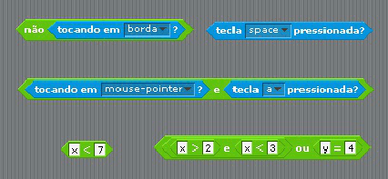
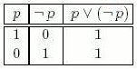
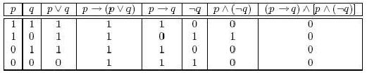
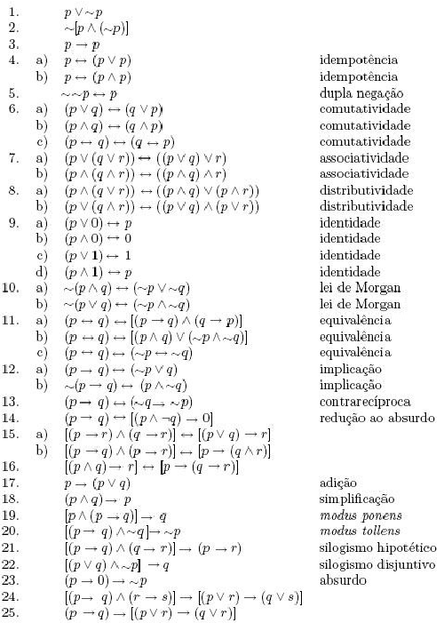

<script src="https://cdnjs.cloudflare.com/ajax/libs/mathjax/2.7.0/MathJax.js?config=TeX-AMS-MML_HTMLorMML" type="text/javascript"></script>


Chapter 2
======


## Lógica proposicional

> "Poder-se-á definir a Lógica como a ciência das regras que legitimam
a utilização da palavra portanto." B. Ruyer in Logique. 

### Proposição

No caso das instruções *if* e *while*, a execução dum bloco de código está dependente da avaliação duma função proposicional (condição). Com o objectivo de estudar estas instruções e formalizar a noção de função proposicional começa-se por rever algumas noções de lógica proposicional e do cálculo de predicados.



Os elementos básicos da lógica são as *proposições* ou *sentenças* que se entendem como afirmações precisas. Na lógica clássica, que abordamos, a avaliação duma proposição é regida por dois princípios fundamentais:
- **Princípio da não contradição** - Uma proposição não pode ser simultaneamente verdadeira e falsa;
- **Princípio do terceiro excluído** - Uma proposição ou é verdadeira ou é falsa;

Por exemplo "1 é maior que 3" é uma proposição cujo valor lógico é o de
"falsidade" enquanto que "todos os triângulos têm três lados e três ângulos" é uma proposição cujo valor lógico é o de "verdade". 

Por outro lado "*x < 3*" não é uma proposição (depende do valor que venha a ser atribuído à variável *x*) sendo denominada *função proposicional*. 

Representam-se por letras (geralmente minúsculas) as proposições genéricas (ou variáveis proposicionais) e por 1 (ou V) e 0 (ou F) os valores lógicos de "*verdade*" e "*falsidade*", respectivamente. 

A área da lógica que trata as proposições neste contexto é designada por *cálculo proposicional* ou *lógica proposicional*.

### Proposição simples e proposição composta
Por vezes combinam-se várias proposições para obter proposições mais expressivas. Neste sentido, classificamos as proposições como **simples** (também denominada atómica) ou
**composta** (também denominada molecular).

As proposições simples apresentam apenas uma afirmação:
      
- $p:$ $\sqrt{2}$ não é um número racional.

- $q:$ existem mais números reais que inteiros.

- $v:$ $1=2$.

- $r:2+3>4$.

As proposições compostas são definidas por uma ou por mais do que uma
proposição, usando na sua formação **operadores lógicos**
(também designados de **conectivas lógicas** ou operadores para formação de proposições):

- $x = 2$ e $y = 1$.

- se $x > y$ então $y < x$.

- não é verdade que $2+3>4$.


#### Conectivas lógicas
Em cálculo proposicional as proposições são geradas a partir de proposições simples, usando operadores para formação de proposições. Vamos tomar como sintacticamente válidas proposições compostas da forma:

- *não* $p$,
- $p$ *e* $q$,
- $p$ *ou* $q$,
- *ou* $p$ *ou* (exclusivo) $q$,
- *se* $p$ *então* $q$,
- $p$ *se e só se* $q$.

onde $p$ e $q$ são proposições (simples ou compostas). Neste casos, em geral, pretende-se obter os valores lógicos das proposições compostas em função dos valores lógicos conhecidos das proposições mais simples que as compõem. Por forma a podermos formalizar a lógica e a avaliação de proposições, convencionamos a seguinte representação para os operadores sintácticos usados na formação de proposições:

Operações Lógicas | Símbolos | Notação | Significado
------------------|----------|---------|------------
Negação | $\neg$ ou $\sim$ | $\neg p$ | não *p*
Conjunção | $\wedge$ | $p \wedge q$ | *p* e *q*
Disjunção | $\vee$ | $p \vee q$ | *p* ou *q* 
Disjunção exclusiva | $\oplus$ ou $\dot{\vee}$ | $p\oplus q$ |  ou *p* ou (exclusivo) *q* 
Implicação | $\rightarrow$ | $p\rightarrow q$ | se *p* então *q* 
Bi-implicação | $\leftrightarrow$ | $p\leftrightarrow q$ | *p* se só se *q*

#### Negação
Seja $p$ uma proposição. A afirmação "não se verifica que
*p*" é uma nova proposição, designada de **negação** de $p$. A
negação de $p$ é denotada por $\neg p$ ou $\sim p$. A proposição
$\neg p$ deve ler-se "não *p*" e é verdadeira se *p* é falsa. A proposição $\neg p$ é falsa se *p* é verdadeira.

É usual definir a interpretação dum operador lógico através de
tabelas do tipo:


  $p$ | $\neg p$
:----:|:-------:
  T | F 
  F | T

 ou 

  $p$ | $\neg p$ 
:----:|:--------:  
  1 | 0 
  0 | 1

stas tabelas são designadas por **tabelas de verdade**. Neste
caso define completamente o operador negação, relacionando os
valores lógicos de *p* e $\neg p$.

Note que, em linguagem corrente nem sempre se pode negar logicamente uma proposição,
antepondo o advérbio "não" ao verbo da proposição, isto apenas se verifica nos casos mais simples.

Por exemplo: negar "Hoje é sábado." é afirmar "Hoje não é sábado".

Mas negar que "Todas as aves voam" é o mesmo que afirmar "não se verifica que todas as aves voam" o que é equivalente a afirmar que "Nem todas as aves voam" mas não é afirmar que "Todas as aves não voam".

Em linguagem Matemática, dado o rigor da interpretação das
designações usadas, o processo de negação fica simplificado. Por
exemplo, negar "*5>2*" é o mesmo que afirmar "$\neg$*(5>2)*" que é equivalente, por definição da relação *>*, a escrever "*5*$\leq$*2*". Assim como "*5>2*" é verdade, temos pela interpretação da negação que "$\neg$*(5>2)*" é falso.


```python
#
# Tabela da Negação
#
for p in [True,False]:
    print('not',p,"=", not p)
```

    not True = False
    not False = True


#### Conjunção
Sejam $p$ e $q$ proposições. A proposição "$p$ e $q$", denotada
$p\wedge q$, é a proposição que é verdadeira apenas quando $p$ e $q$
são ambas verdadeiras, caso contrário é falsa. A proposição $p\wedge q$
diz-se a \textbf{conjunção} de $p$ e $q$.

Assim, os valores lógicos das três proposições $p$, $q$, e $p\wedge
q$ estão relacionados pela tabela de verdade:
    
  $p$ |  $q$ | $p$ $\wedge$ $q$ 
:-----:|:----:|:--------:
  V | V  |   V 
  V | F  |   F 
  F | V  |   F 
  F | F  |   F

Note que a tabela tem quatro linhas, uma por cada combinação
possível de valores de verdade para as proposições $p$ e $q$.


```python
#
# Tabela da conjunção
#
for p in [True,False]:
    for q in [True,False]:
        print(p,'and',q,'=', p and q)
```

    True and True = True
    True and False = False
    False and True = False
    False and False = False


#### Disjunção
Sejam *p* e *q* proposições. A proposição "$p$ ou $q$", denotada
*p$\vee$q*, é a proposição que é falsa apenas quando $p$ e $q$ são
ambas falsas, caso contrário é verdade. A proposição *p$\vee$q*
diz-se a **disjunção** de *p* e *q*.
A tabela de verdade de *p $\vee$q* toma assim a forma:

  $p$ | $q$ | $p$ $\vee$ $q$ 
:------:|:-----:|:---------:
   V  | V   |    V 
   V  | F   |    V 
   F  | V   |    V 
   F  | F   |    F

A conectiva **ou** é interpretada na versão inclusiva da
palavra "ou" em linguagem corrente. Note que, nas proposições seguintes *ou* tem ou *significado inclusivo* ou *significado
exclusivo* consoante o contexto de interpretação:
- O João pratica futebol ou natação.[ou ambas as coisas]
- Ele é do Sporting ou do Porto.[mas não as duas coisas]


```python
#
# Tabela da disjunção
#
for p in [True,False]:
    for q in [True,False]:
        print(p,'or',q,'=', p or q)
```

    True or True = True
    True or False = True
    False or True = True
    False or False = False


#### Disjunção exclusiva

Para tornar a interpretação da disjunção independente do contexto definimos:  A **disjunção exclusiva**
de *p* e *q*, denotada *p$\oplus$q* ou *p$\dot{\vee}$q*, é a
proposição que é verdade apenas quando, ou *p* é verdadeira ou *q* é
verdadeira, caso contrário é falsa.

A tabela de verdade de *p$\oplus$q* toma assim a forma:

  $p$ | $q$ | $p$ $\oplus$  $q$ 
:------:|:-----:|:--------:
   V  |  V  |  F 
   V  |  F  |  V 
   F  |  V  |  V 
   F  |  F  |  F
   


```python
#
# Tabela da disjunção exclusiva
#
for p in [True,False]:
    for q in [True,False]:
        if p!=q:
            print(p,'xor',q,'=', True)
        else:
            print(p,'xor',q,'=', False)
```

    True xor True = False
    True xor False = True
    False xor True = True
    False xor False = False


##### Exercício:
Relacione o valor lógico das proposições $p$, $q$, $r$ e
$(p\wedge (\neg q))\oplus (r\vee p)$.

##### Exercício:
  Indique os valores (de verdade ou falsidade) das seguintes afirmações:
- $3\leq 7$ e 4 é um número inteiro ímpar.
- $3\leq 7$ ou 4 é um número inteiro ímpar.
- 5 é ímpar ou divisível por 4.

#### Implicação
Sejam *p* e *q* proposições. A implicação *p$\rightarrow$q* é
a proposição que é falsa quando *p* é verdadeira e *q* é falsa, nos
outros casos é verdadeira.

A tabela de verdade de *p$\rightarrow$q* toma assim a forma:

  $p$ | $q$ | $p$ $\rightarrow$ $q$ 
:------:|:-----:|:----------:
   V  |  V  |   V 
   V  |  F  |   F 
   F  |  V  |   V 
   F  |  F  |   V

Numa proposição do tipo *p$\rightarrow$q* a proposição *p* recebe o
nome de **hipótese** (antecedente ou premissa) e a *q* chama-se
**tese** (conclusão ou consequente). A proposição *p$\rightarrow$q* também é muitas vezes designada por **declaração
condicional**. Estas designações são compatíveis com o uso da implicação em linguagem corrente, devemos no entanto notar que a tabela entra em conflito com a interpretação que fazemos da implicação: neste caso não se dirá "*p* implica *q*" quando se sabe à priori que *p* é falsa. Na interpretação que apresentamos para a implicação ela é verdade sempre que "*p*" é falsa independentemente do valor lógico de "*q*". Esta situação pode ilustrar-se com a implicação "se 1+1=1 então 2=3" que é verdadeira, uma vez que o antecedente é falso.


```python
#
# Tabela da implicação
#

for p in [True,False]:
    for q in [True,False]:
        if p and not q:
            print(p,'-->',q,'=',False)
        else:
            print(p,'-->',q,'=',True)
```

    True --> True = True
    True --> False = False
    False --> True = True
    False --> False = True


#### Bi-implicação
Sejam *p* e *q* proposições. A **bi-condicional** ou **bi-implicação** de *p* e *q* é a proposição *p$\leftrightarrow$q* que é verdadeira
quando *p* e *q* têm o mesmo valor lógico.

A tabela de verdade de *p$\leftrightarrow$q* toma assim a forma:


  $p$ | $q$ | $p$ $\leftrightarrow$ $q$ 
:------:|:-----:|:----------:
   V  |  V  |   V 
   V  |  F  |   F 
   F  |  V  |   F 
   F  |  F  |   V

A proposição *p$\leftrightarrow$q* deve ler-se "*p* se e só se *q*"
(abreviado por "*p* sse *q*") ou "*p* é condição necessária e
suficiente para *q*".


```python
#
# Tabela da disjunção exclusiva
#
for p in [True,False]:
    for q in [True,False]:
        if p==q:
            print(p,'<->',q,'=', True)
        else:
            print(p,'<->',q,'=', False)
```

    True <-> True = True
    True <-> False = False
    False <-> True = False
    False <-> False = True


Facilmente podemos mostrar que as proposições *p$\leftrightarrow$q*
e  $(p\rightarrow q)\wedge(q\rightarrow p)$ têm os mesmos valores
lógicos, ou seja a proposição $(p\leftrightarrow  q)\leftrightarrow
((p\rightarrow q)\wedge(q\rightarrow p))$ é sempre verdadeira.


(p | $\leftrightarrow$ | q) | $\leftrightarrow$ | ((p | $\rightarrow$ | q) | $\wedge$ | (q | $\rightarrow$  | p)) 
:------:|:----:|:----:|:----:|:----:|:----:|:----:|:----:|:----:|:----:|:----: 
  V   |  V | V  |  V |  V |  V |  V |  V |  V |  V |  V 
  V   |  F | F  |  V |  V |  F |  F |  F |  F |  V |  V 
  F   |  F | V  |  V |  F |  V |  V |  F |  V |  F |  F 
  F   |  V | F  |  V |  F |  V |  F |  V |  F |  V |  F 
------|----|----|----|----|----|----|----|----|----|---- 
1  | 2 | 1 | 4 | 1 | 2 | 1 | 3 | 1 | 2 | 1 


##### Exercício:
Suponhamos que *p,q,r* representam as seguintes sentenças:

>$p:$"7 é um número inteiro par"

>$q:3+1=4$

>$r:$"24 é divisível por 8"

1. Escreva em linguagem simbólica as proposições

    1. $3+1\neq 4$ e 24 é divisível por 8
    
    1. não é verdade que 7 seja ímpar ou 3+1=4
    
    1. se 3+1=4 então 24 não é divisível por 8
    
1. Escreva por palavras as sentenças

    1. $p\vee(\neg q)$
    
    1. $\neg(p\wedge q)$
    
    1. $(\neg r)\vee (\neg q)$
    

##### Exercício:
Construir as tabelas de verdade das seguintes proposições:
1. $((p\rightarrow q)\wedge p)\rightarrow q$
1. $p\leftrightarrow(q\rightarrow r)$
1. $(p\wedge(\neg p))\rightarrow q$
1. $((p\vee r)\wedge(q\vee r))\wedge((\neg p)\vee (\neg r))$
1. $(p\wedge(q\vee r))\wedge (q\wedge (p\vee r))$

##### Exercício:
Quantas linhas tem a tabela de verdade de uma proposição com $n$ variáveis proposicionais?

#### Ordem de precedência das conectivas lógicas
Até aqui, temos usado parêntesis para definir a ordem de
aplicação dos operadores lógicos numa proposição composta. Por forma
a reduzir o número de parêntesis adoptamos a seguinte convenção: Sempre que numa expressão estiverem presentes várias operações lógicas, **convenciona-se**, na ausência de parêntesis, que as operações se efectuem na ordem seguinte:
1. a negação;
1. a conjunção e a disjunção;
1. a implicação e a bi-implicação.

Assim,
1. $p\rightarrow ((\neg p)\vee r)$ pode escrever-se $p\rightarrow \neg p\vee r$;
1. $(p\wedge (\neg q))\leftrightarrow c$ pode escrever-se $p\wedge \neg q\leftrightarrow c$;
1. $p\vee q\wedge \neg r \rightarrow p \rightarrow\neg q$ deve ser entendida como
$(((p\vee q)\wedge(\neg r))\rightarrow p) \rightarrow(\neg q)$.

### Tautologia
Chama-se **tautologia** (ou fórmula logicamente
verdadeira) a uma proposição que é verdadeira, para quaisquer que sejam os valores lógicos atribuídos às variáveis proposicionais que a compõem. Dito de outra forma, chama-se tautologia a uma proposição cuja coluna correspondente na tabela de verdade possui apenas Vs ou 1s. Exemplo duma tautologia é a proposição $p\vee(\neg p)$, designada de "Princípio do terceiro excluído",




A negação duma tautologia, ou seja uma proposição que é sempre falsa, diz-se uma **contra-tautologia** ou **contradição**. Se uma proposição não é nem uma tautologia nem uma contradição denomina-se por **contingência**.

Não deve confundir-se contradição com proposição falsa, assim como não deve confundir-se tautologia com proposição verdadeira. O facto de uma tautologia ser sempre verdadeira e uma contradição ser sempre falsa deve-se à sua forma lógica (sintaxe) e não ao significado que se lhes pode atribuir (semântica).

A tabela de verdade



mostra que $p\rightarrow(p\vee q)$ é uma tautologia, enquanto que $(p\rightarrow q)\wedge (p\wedge (\neg q))$ é uma contradição.


#### Exercício
Mostre que são tautologias:
1. $(\neg q\rightarrow \neg p)\leftrightarrow(p\rightarrow q)$
1. $(p\leftrightarrow  q)\leftrightarrow ((p\rightarrow q)\wedge(q\rightarrow p))$

Exemplos de outras tautologias são apresentadas abaixo:



### Equivalências proposicionais

As proposições $p$ e $q$ dizem-se **logicamente
equivalentes** se $p\leftrightarrow q$ é uma tautologia. Por $p\equiv
q$ ou $p\Leftrightarrow q$ denotamos que $p$ e $q$ são logicamente
equivalentes.

Diz-se que a proposição $p$ **implica logicamente** a proposição $q$ se a veracidade da primeira arrastar necessariamente a veracidade da segunda, ou seja, se a proposição *p$\rightarrow$q* for uma tautologia.


1. $\neg q\rightarrow \neg p \Leftrightarrow p\rightarrow q$

$\neg$ |  $q$  | $\rightarrow$ | $\neg$ | $p$ 
:-----------:|:-------:|:---------------:|:--------:|:-----:
F  |  V  |  V  |   F   |   V 
V  |  F  |  F  |   F   |   V 
F  |  V  |  V  |   V   |   F 
V  |  F  |  V  |   V   |   F 
-----------|-------|---------------|--------|-----
2  |  1  |  3  |   2   |   1 

e


$p$  | $\rightarrow$ |  $q$ 
:-----:|:-------------:|:----:  
V | V | V 
V | F | F 
F | V | V 
F | V | F 
-------|---------------|------ 
1 | 2 | 1 


1. $p\leftrightarrow  q\Leftrightarrow (p\rightarrow q)\wedge(q\rightarrow p)$


($p$ | $\leftrightarrow$ | q) | $\leftrightarrow$ | (($p$ | $\rightarrow$ | $q$) | $\wedge$ | ($q$ | $\rightarrow$  | $p$)) 
:----:|:----:|:----:|:----:|:----:|:----:|:----:|:----:|:----:|:----:|:----:
V | V | V | V | V | V | V | V | V | V | V 
V | F | F | V | V | F | F | F | F | V | V 
F | F | V | V | F | V | V | F | V | F | F 
F | V | F | V | F | V | F | V | F | V | F 
----|----|----|----|----|----|----|----|----|----|----
  1 |  2 |  1 |  4 |  1 |  2 |  1 |  3 |  1 |  2 |  1 

Deste modo,  a equivalência proposicional pode ser sempre verificada através duma tabela de verdade. Em particular, as proposições $p$ e $q$ são equivalentes se e só se as colunas, na tabela de verdade, que determinam os seu valores lógicos coincidirem.


#### Exercício
Mostre que são exemplos de equivalências proposicionais:
1. $\neg(p\vee \neg p) \Leftrightarrow p \wedge \neg p$
1. $\neg (p\vee q)\Leftrightarrow \neg p \wedge \neg q$
1. $\neg p\vee q \Leftrightarrow p \rightarrow q$
1. $p\vee(q\wedge r)\Leftrightarrow(p\vee q)\wedge(p\vee r)$

#### Exercício
Indique quais das sentenças seguintes são equivalentes:
1. $p\wedge(\neg q)$
1. $p\rightarrow q$
1. $\neg((\neg p)\vee q)$
1. $q\rightarrow(\neg q)$
1. $(\neg p)\vee q$
1. $\neg(p\rightarrow q)$
1. $p\rightarrow(\neg q)$
1. $(\neg p)\rightarrow (\neg q)$

#### Exercício
Mostre que cada uma das proposições que se seguem:
1. $(\neg p)\vee q$
1. $(\neg q)\rightarrow (\neg p)$
1. $\neg(p\wedge (\neg q))$
é equivalente a $p\rightarrow q$.


#### Exercício
Mostre que:
1. $p\vee(q\wedge r)$ não é logicamente equivalente a $(p\vee q)\wedge r$.
1. $p\vee (q\wedge r)$ é logicamente equivalente a $(p\vee q)\wedge (p\vee r)$.
1. $p\vee(\neg (q  \vee r))$ é logicamente equivalente a $(p\vee(\neg q))\vee(\neg r)$

De seguida apresentamos exemplos de equivalências úteis para o que se segue (que podem ser verificadas através de tabelas de verdade):

   Nome      |      Propriedade     |    Propriedade 
-------------|----------------------|-------------------
Comutatividade | $p \wedge q \Leftrightarrow q \wedge p$ | $p \vee q \Leftrightarrow q \vee p$ 
Associativa| $(p\wedge q)\wedge r \Leftrightarrow p \wedge (q \wedge r)$ | $(p\vee q)\vee r \Leftrightarrow p \vee (q \vee r)$ 
Idempotência | $p\wedge p \Leftrightarrow p$ | $p\vee p \Leftrightarrow p$ 
Identidade | $p\wedge V\Leftrightarrow p$ | $p\vee F\Leftrightarrow p$ 
Dominância | $p\wedge F\Leftrightarrow F$ | $p\vee V\Leftrightarrow V$ 
Absorção | $p\wedge(p\vee r)\Leftrightarrow p$ |$p\vee(p\wedge r)\Leftrightarrow p$
Distributivas | $p\wedge(q\vee r)\Leftrightarrow(p\wedge q)\vee(p\wedge r)$ | $p\vee(q\wedge r)\Leftrightarrow(p\vee q)\wedge(p\vee r)$ 
Distributivas | $p\rightarrow(q\vee r)\Leftrightarrow(p\rightarrow q)\vee(p\rightarrow r)$ | $p\rightarrow(q\wedge r)\Leftrightarrow (p\rightarrow q)\wedge(p\rightarrow r)$ 
Leis de De Morgan | $\neg (p\wedge q)\Leftrightarrow \neg p \vee \neg q$ |  $\neg (p\vee q)\Leftrightarrow \neg p \wedge \neg q$
Def. Implicação | $p\rightarrow q \Leftrightarrow \neg p \vee q$ | $p\rightarrow q\Leftrightarrow \neg(p\wedge\neg q)$ 
Def. Bi-condicional | $p\leftrightarrow q \Leftrightarrow (p\rightarrow q) \wedge (q \rightarrow p)$ | $p\leftrightarrow q \Leftrightarrow (\neg p \vee q) \wedge (\neg q \vee p)$ 
Negação | $\neg(\neg p)\Leftrightarrow p$ | 
Contraposição | $p\rightarrow q \Leftrightarrow \neg q \rightarrow \neg p$| 
Troca de premissas | $p\rightarrow (q\rightarrow r)\Leftrightarrow q\rightarrow (p\rightarrow r)$ | 

As equivalências lógicas apresentadas na tabela anterior, podem ser usadas na determinação de equivalências lógicas adicionais. Isso porque, podemos numa proposição composta, substituir
proposições por proposições que lhes sejam equivalentes
sem que isso altere os valores de verdade da proposição original.

Por exemplo:

$$
\begin{array}{rcll}
  \neg(p\vee(\neg p \wedge q)) & \Leftrightarrow & \neg p \wedge \neg(\neg p \wedge q) & \text{da segunda lei de De Morgan} \\
  & \Leftrightarrow & \neg p \wedge [\neg(\neg p) \vee \neg q] & \text{da primeira lei de De Morgan} \\
  & \Leftrightarrow & \neg p \wedge (p\vee \neg q) & \text{da lei da dupla negação} \\
  & \Leftrightarrow & (\neg p \wedge p) \vee (\neg p \wedge \neg q) & \text{da segunda distributividade} \\
  & \Leftrightarrow & F \vee (\neg p \wedge \neg q) & \text{já que } \neg p \wedge p \Leftrightarrow F \\
  & \Leftrightarrow & \neg p \wedge \neg q & \text{da lei identidade}
\end{array}
$$

Donde podemos concluir que $\neg(p\vee(\neg p \wedge q))$ e $\neg p
\wedge \neg q$ são proposições logicamente equivalentes:
$$
 \neg(p\vee(\neg p \wedge q)) \Leftrightarrow \neg p \wedge \neg q
$$


#### Exercício
Simplifique as seguintes proposições:
1. $p\vee(q\wedge (\neg p))$
1. $\neg(p\vee(q\wedge(\neg r)))\wedge q$
1. $\neg((\neg p)\wedge(\neg q))$
1. $\neg((\neg p)\vee q)\vee(p\wedge(\neg r))$
1. $(p\wedge q)\vee (p\wedge (\neg q))$
1. $(p\wedge r)\vee((\neg r)\wedge (p\vee q))$


#### Exercício
Por vezes usa-se o símbolo $\downarrow$ para construir proposições compostas $p\downarrow q$ definidas por duas proposições $p$ e $q$, que é verdadeira quando e só quando $p$ e $q$ são simultaneamente falsas, e é falsa em todos os outros casos. A proposição $p\downarrow q$ lê-se "nem $p$ nem $q$".
1. Apresente a tabela de verdade de $p\downarrow q$.
1. Expresse $p\downarrow q$ em termos das conectivas $\wedge,\vee$ e $\neg$.
1. Determine proposições apenas definidas pela conectiva $\downarrow$ que sejam equivalentes a $\neg p$, $p\wedge q$ e $p\vee q$.

#### Exercício
Expresse a proposição $p\leftrightarrow q$ usando apenas os símbolos $\wedge,\vee$ e $\neg$.

### Considerações sobre a implicação
As duas primeiras linhas da tabela da implicação


  $p$  |  $q$  |  $p\rightarrow q$ 
:-------:|:-------:|:------------:
  V  |  V | V 
  V  |  F | F 
  F  |  V | V 
  F  |  F | V


não apresentam qualquer problema sob o ponto de vista intuitivo do senso comum. Quanto às duas últimas, qualquer outra escolha possível apresenta desvantagens sob o ponto de vista lógico, o que levou à escolha das soluções apresentadas, já que:

1. fazendo F na 3º linha e F na 4º linha, obtém-se a tabela da conjunção
1. fazendo F na 3º linha e V na 4º linha, obtém-se a tabela da bi-implicação
1. resta a possibilidade de fazer V na 3º linha e F na 4º linha que também não é, pois isso equivaleria a recusar a equivalência
$$
(p\rightarrow q)\Leftrightarrow(\neg q\rightarrow\neg p)
$$
que é uma equivalência aconselhável, já que a proposição "se o Pedro fala, existe" é (intuitivamente) equivalente à proposição "se o Pedro não existe, não fala". A aceitação desta equivalência impõe a tabela considerada para a implicação.


$\neg$ | $q$ | $\rightarrow$ | $\neg$ | $p$ 
:-------:|:-----:|:---------------:|:--------:|:-------:
 F | V | V | F | V
 V | F | F | F | V 
 F | V | V | V | F 
 V | F | V | V | F 
-------|-----|---------------|--------|-------
2 | 1 | 3 | 2 | 1 

e 

$p$ | $\rightarrow$ | $q$ 
:----:|:---------------:|:-------:
V | V | V 
V | F | F 
F | V | V 
F | V | F 
----|---------------|-------
1 | 2 | 1 

A partir duma implicação $r$ dada por $p\rightarrow q$ define-se as
proposições:
1. $q\rightarrow p$, designada de *recíproca* da implicação $r$;
1. $\neg q\rightarrow \neg p$, designada por *contra-recíproca* de $r$;
1. $\neg p\rightarrow \neg q$, designada por *inversa* de $r$.
Observe-se que, embora a contra-recíproca seja equivalente à proposição original, o mesmo não acontece com a recíproca (e a inversa, que lhe é equivalente) o que se pode verificar através das respectivas tabelas de verdade.


#### Exercício
Determine:
1. a contra-recíproca de $(\neg p)\rightarrow q$
1. a inversa de $(\neg q)\rightarrow p$
1. a recíproca da inversa de $q\rightarrow (\neg p)$
1. a negação de $p\rightarrow (\neg q)$

## Voltando ao Python

### Python: de volta às cláusulas if


O mecanismo que mais temos usado para controlo de fluxo da execução são cláusulas if. Por exemplo:


```python
x = int(input("Escreva um inteiro: "))
```

    Escreva um inteiro: 42


```python
if x < 0:
    x = 0
    print('É negativo... vou transforma-lo em zero!')
elif x == 0:
    print('É zero')
elif x == 1:
    print('É a unidade.')
else:
    print('É num número grande!')
```

    É num número grande!


Já vimos que podem existir um ou mais blocos elif, e o bloco else é opcional. O comando elif é uma abreviação para ``else if'', sendo útil para reduzir a quantidade de indentações. Uma sequência if ... elif ... elif ... é o substituto para os comandos switch ou case disponíveis noutras linguagens de programação.


### Python: de volta  ao comando for

Como vimos no Python o comando *for* permite iterar sobre objectos de qualquer sequência (uma lista ou uma string) ou um conjunto, nas sequências o ciclo *for* segue a ordem pela qual os objectos aparecem na sequência. Por examplo:


```python
# Medindo strings
words = ['Platão', 'Sócrates', 'Eu']
for w in words:
    print(w, len(w))
```

    Platão 6
    Sócrates 8
    Eu 2


Caso tenha de modificar a sequência durante o ciclo *for* (por exemplo para duplicar elementos seleccionados), é conveniente fazer primeiro uma cópia. A noção de slice torna isso possível:


```python
for w in words[:]:
    if len(w) > 6:
        words.insert(0, w)
```


```python
words
```


    ['Sócrates', 'Platão', 'Sócrates', 'Eu']


### Python: A função range()
Quando temos de iterar numa sequência de números, a função built-in  *range*() trata do assunto. Permitindo gerar progressões aritméticas


```python
L=range(10)
```


```python
for i in L: print(i,' ',end='')
```

    0  1  2  3  4  5  6  7  8  9  

O ponto final nunca é parte da lista gerada; range(10) gera uma sequência de 10 valores, os índices de uma lista com 10 objectos. É possível fazer o domínio ter inicio noutro número, ou indicar um incremento diferente (mesmo negativo; este incremento é usualmente designado de 'passo'):


```python
for i in range(5, 10): print(i,' ',end='')
```

    5  6  7  8  9  


```python
for i in range(0, 10, 3): print(i,' ',end='')
```

    0  3  6  9  


```python
for i in range(-10, -100, -30): print(i,' ',end='')
```

    -10  -40  -70  

Para iterar nos índices de uma sequência, pode combinar *range*() com a função *len*() como por exemplo:


```python
a = ['Euler', 'Decarte', 'Pascal', 'Newton', 'Eu']
for i in range(len(a)):
    print( i, a[i])
```

    0 Euler
    1 Decarte
    2 Pascal
    3 Newton
    4 Eu


Na maioria dos casos, é conveniente usar a função enumerate().

### Python:Comando break e continue, e cláusulas else nos ciclos

O comando *break*, permite encurtar os ciclos *for* ou *while*.

Os ciclos podem ter uma cláusula *else*; que é executado após ter percorrido todo o domínio do ciclo *for* ou quando a condição dum ciclo  *while* se torna falsa, mas nunca quando o ciclo é interrompido com um comando *break*. Exemplificamos isto no ciclo seguinte, que tem por objectivo determinar números primos (recorde quando é um número natural primo):


```python
#
# O crivo de Eratóstenes
#
for n in range(2, 10):
    for m in range(2, n):
        if n % m == 0:
            print(n, '=', m, '*', n//m, "=>",n,'não é primo')
            break
        else:
            print(n,' é um primo')
```

    3  é um primo
    4 = 2 * 2 => 4 não é primo
    5  é um primo
    5  é um primo
    5  é um primo
    6 = 2 * 3 => 6 não é primo
    7  é um primo
    7  é um primo
    7  é um primo
    7  é um primo
    7  é um primo
    8 = 2 * 4 => 8 não é primo
    9  é um primo
    9 = 3 * 3 => 9 não é primo


O que faz a operador binário %?


```python

```

O que faz a operador binário //? Onde está a diferênça entre / e //


```python

```

O comando *continue* pára a iteração corrente, saltando para a iteração seguinte do *loop*:


```python
for num in range(2, 10):
    if num % 2 == 0:
        print("É par o número ", num)
        continue
    print("O número ", num, "é ímpar")
```

    É par o número  2
    O número  3 é ímpar
    É par o número  4
    O número  5 é ímpar
    É par o número  6
    O número  7 é ímpar
    É par o número  8
    O número  9 é ímpar


## Exercícios de python

##### Exercício:

Implemente os operadores de implicação e bi-implicação, através de funções

    imp(bool,bool)->bool e biimp(bool,bool)->bool.


```python
def imp(p,q):
    u''' imp(bool,bool)->bool
         Operador de implicação '''
    return not p or q
```


```python
def biimp(p,q):
    u''' biimp(bool,bool)->bool
         Operador de bi-implicação'''
    return imp(p,q) and imp(q,p)
```


```python
imp(False,True)
```


    True


```python
biimp(False,True)
```


    False


##### Exercício:
Apresente as tabelas de verdade  da implicação da bi-implicação e da proposição $P4:(p\rightarrow q)\vee h$. Por exemplo, tal que

      >>> TabelaP4()
      -----------------------------
        p  |  q  |  h  | (p->q)|h
      -----------------------------
      False|False|False|   True
      False|False| True|   True
      False| True|False|   True
      False| True| True|   True
       True|False|False|  False
       True|False| True|   True
       True| True|False|   True
       True| True| True|   True


```python
def TabelaP4():
    u''' TabelaP4()->

       tabela de (p->q)|h'''
    print('p'.center(5)+'|'+'q'.center(5)+'|'+'h'.center(5)+'| (p->q)|h')
    print('-'*27)
    for p in [False,True]:
        for q in [False,True]:
            for h in [False,True]:
                aval = imp(p,q) or h
                print(str(p).center(5)+'|'+str(q).center(5)+'|'+str(h).center(5)+'|'+str(aval).center(10))
```


```python
TabelaP4()
```

      p  |  q  |  h  | (p->q)|h
    ---------------------------
    False|False|False|   True   
    False|False| True|   True   
    False| True|False|   True   
    False| True| True|   True   
     True|False|False|  False   
     True|False| True|   True   
     True| True|False|   True   
     True| True| True|   True   


##### Exercício:
Defina a função
     cab(list)->
em que dado uma lista de strings ['p1','p2','p3',...,'pn'], imprima o cabeçalho duma tabela de verdade. Por exemplo, tal que
    >>> cab(['p1','p2','imp(p1,p2)'])
    -------------------------
     p1  | p2  |  imp(p1,p2)
    -------------------------


```python
def cab(lista):
    u''' cab(list)->

         Imprime cabeçalho de tabela'''
    print('-'*5*(len(lista)+1))
    for prop in lista[:-1]:
        print(prop.center(5)+'|', end='')
    print(lista[-1])  # imprime último elemento
    print('-'*5*(len(lista)+1))
```


```python
cab(['p1','p2','imp(p1,p2)'])
```

    --------------------
      p1 |  p2 |imp(p1,p2)
    --------------------


##### Exercício:
Defina a função
    linha(list)->
em que dada uma lista de valores lógicos ['p1','p2','p3',...,'pn'], imprima uma linha 'p1|p2|p3|...|pn' duma tabela de verdade, onde cada valor lógico está numa string com 5 posições. Por exemplo, tal que
      >>> linha([True,False,True])
       True|False| True


```python
def linha(lista):
    u''' linha(list)->

         Imprime linha de tabela'''
    for prop in lista[:-1]:
        print(str(prop).center(5)+'|', end='')
    print(str(lista[-1]))  # imprime último elemento
```


```python
linha([True,False,True])
```

     True|False|True


##### Exercício:
Defina uma função trad(string)->string que faça a tradução duma expressão proposicional codificada, usando os símbolos 0,1,\&,$|$ e $\sim$, numa expressão proposicional no Python usando False, True, and, or e not. Por exemplo, tal que
      >>>  trad('(p&~(q|w))')
      '(p and  not (q or w))'


```python
def trad(exp):
    u''' trans(str)->str 
 
         Tradução duma expressão proposicional codificada,
         usando os símbolos 0,1,\&,$|$ e $\sim$, numa expressão
         proposicional no Python usando False, True, and, or e not.
         '''
    exp = exp.replace('0','False')
    exp = exp.replace('1','True')
    exp = exp.replace('&',' and ')
    exp = exp.replace('|',' or ')
    exp = exp.replace('~',' not ')
    return exp
```


```python
trad('(p&~(q|w))')
```


    '(p and  not (q or w))'


##### Exercício:
Defina a função

       Eval(string,list)->bool
       
que avalia a expressão proposicional, na sintaxe do Python, associando a cada variável usada <var> o valor lógico <bool>. A associação entre variáveis e valores lógicos deve ser descrita por pares (<var>,<bool>) na lista que serve de argumento.

    Eval('(p1 and  not (p2 or p3))',[('p1',True),('p2',False),('p3',True)])} avalia '(True and  not (False or True))'.

Por exemplo, tal que

    >>>  Eval('not(p1 and p2) or p1',[('p1',True),('p2',False)])
    True


```python
def Eval(exp, atrib):
    u''' Eval(string,list)->bool

         Avalia a expressão proposicional, na sintaxe do Python,
         associando a cada variável usada <var> o valor lógico <bool>.
         A associação entre variáveis e valores lógicos deve ser descrita
         por pares (<var>,<bool>) na lista que serve de argumento.
             '''
    for var in atrib:
        exp = exp.replace(var[0],str(var[1]))
    return eval(exp)
```


```python
Eval('not(p1 and p2) or p1',[('p1',True),('p2',False)])
```


    True


##### Exercício:
Represente em representação binário os números de $2^n-1$ até zero. Exemplo:

    >>> binlist(3)
    111
    110
    101
    100
    011
    010
    001
    000


```python
def binlist(nvar):
    u''' binlist(int)->

         lista em representação binária os números de 2**n-1 até 0
             '''
    for n in range(2**nvar-1,-1,-1):
        print(bin(n)[2:].rjust(nvar,'0'))
```


```python
binlist(3)
```

    111
    110
    101
    100
    011
    010
    001
    000


##### Exercício:
Usando as funções anteriores, defina uma função
     tabela(string, list)->
que imprima a tabela de verdade da proposição $q$, descrita pela string, assumindo que as suas variáveis estão na lista $[p1,p2,...,pn]$. (USANDO: a linguagem proposicional de símbolos 0,1,\&,$|$ e $\sim$, mais as funções imp(bool,bool)->bool e biimp(bool,bool)->bool))
    Por exemplo, tal que

      >>> tabela('imp(u,q)|w',['u','q','w'])
        -------------------------
          u  |  q  |  w  |imp(u,q)|w
        -------------------------
         True| True| True|True
         True| True|False|True
         True|False| True|True
         True|False|False|False
        False| True| True|True
        False| True|False|True
        False|False| True|True
        False|False|False|True


```python
def tabela(exp,var):
    u''' tabela(str,list)->

         Imprime a tabela de verdade da proposição descrita pela string,
         assumindo que as suas variáveis estão na lista.
         USANDO: a linguagem proposicional de símbolos 0,1,\&,$|$ e $\sim$,
                 mais as funções imp(bool,bool)->bool e biimp(bool,bool)->bool)
             '''
    cab(var+[exp])
    nvar = len(var)
    for n in range(2**nvar-1,-1,-1):
        l=bin(n)[2:].rjust(nvar,'0')
        cont=0
        lista = []
        vlog = []
        for v in var:
            lista.append((v,bool(int(l[cont]))))
            vlog.append(bool(int(l[cont])))
            cont = cont + 1
        linha(vlog+ [Eval(trad(exp),lista)])
```


```python
tabela('imp(u,q)|w',['u','q','w'])
```

    -------------------------
      u  |  q  |  w  |imp(u,q)|w
    -------------------------
     True| True| True|True
     True| True|False|True
     True|False| True|True
     True|False|False|False
    False| True| True|True
    False| True|False|True
    False|False| True|True
    False|False|False|True


##### Exercício:
Usando as funções anteriores, defina uma função

    tautologia(string, list)->bool

que verifica se a proposição $q$, descrita pela string, é uma tautologia e assumindo que as suas variáveis estão descritas na lista $[p1,p2,...p_n]$. (USANDO: a linguagem proposicional de símbolos 0,1,\&,$|$ e $\sim$, mais as funções imp(bool,bool)->bool e biimp(bool,bool)->bool)

      >>>  tautologia('biimp(~q | w, imp(q,w))',['q','w'])
      False


```python
def tautologia(exp,var):
    u''' tautologia(str,list)->bool

         Verifica se a proposição descrita pela string é uma tautologia,
         assumindo que as suas variáveis estão descritas na lista.
         USANDO: a linguagem proposicional de símbolos 0,1,\&,$|$ e $\sim$,
         mais as funções imp(bool,bool)->bool e biimp(bool,bool)->bool
             '''
    sai = True
    nvar = len(var)
    for n in range(2**nvar-1,-1,-1):
        l=str(bin(n))[2:].rjust(nvar,'0')
        cont=0
        lista = []
        for v in var:
            lista.append((v,bool(int(l[cont]))))
            cont = cont + 1
        sai = sai and bool(Eval(exp,lista))
    return sai
```


```python
tautologia('biimp(~q | w, imp(q,w))',['q','w'])
```


    False


```python

```
