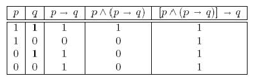
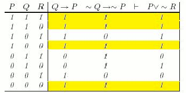
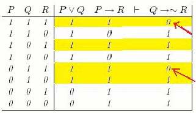

<!-- Start Writing Below in Markdown -->

Capítulo 3: Deducão Natural
======

This chapter introduces more

### Fórmulas bem formadas

Estamos a descrever um sistema formal, denominado de cálculo proposicional clássico, que formaliza a chamada lógica clássica, ou lógica proposicional clássica. O vocabulário desse sistema tem os seguintes símbolos primitivos:

1. uma colecção de símbolos, $A,B,C,\ldots$ ou $P_1,P_2,\ldots$ ou $p,q,r,\ldots$, chamados de símbolos proposicionais,
+ símbolos lógicos $\neg,\wedge,\vee,\rightarrow,\leftrightarrow,\oplus$, e
+ símbolos de pontuação $($ e $)$.

As expressões da linguagem do cálculo proposicional são sequências finitas destes símbolos (\emph{strings}), como $\neg)\vee A))(\vee B$. Convém distinguir entre as expressões ou fórmulas bem formadas (fbf) das demais. Isso é feito impondo um conjunto de regras gramaticais para a linguagem.

As regras gramaticais, para esta linguagem formal, definem por fbf (expressões gramaticalmente bem formadas na linguagem) unicamente aquelas expressões $\alpha$ obtidas por alguma das seguintes cláusulas:
1. $\alpha$ é igual a um símbolo proposicional $A,B,C,\ldots$ ou $P_1,P_2,\ldots$ ou $p,q,r,\ldots$, ou
+ $\alpha$ é igual a $(\neg \beta)$ ou $(\beta\wedge\gamma)$ ou  $(\beta\vee\gamma)$ ou $(\beta\rightarrow\gamma)$ ou  $(\beta\leftrightarrow\gamma)$ ou $(\beta\oplus\gamma)$, onde onde $\beta$ e $\gamma$,
+ nada mais é uma fbf.
Note que, os parêntesis são usados para evitar ambiguidade. Por exemplo, $(\neg p\vee q)$ deve ser distinguida de $\neg(p \vee q)$. No segundo caso, o operador $\neg$ aplica-se à fórmula $(p\vee q)$, ao passo que no primeiro ele é aplicado apenas a $p$.

Na escrita das fbf do cálculo proposicional adoptámos a convenção de eliminar  parêntesis externos e impondo uma ordem de precedência aos operadores. Num sistema formal é frequente a definição de novos símbolos com base em símbolos lógicos primitivos. Na literatura é frequente usar como únicos símbolos primitivos, para o cálculo proposicional,  $\neg$ e $\vee$, a partir dos quais se pode definir os outros fazendo por exemplo:

1. $p\wedge q =_{def}\neg(\neg p\vee\neg q)$
+ $p\rightarrow q =_{def}\neg p\vee q$
+ $p\leftrightarrow q =_{def}(p\rightarrow q)\wedge (q\rightarrow p)$

Note que neste contexto os novos símbolos $\wedge,\rightarrow,\leftrightarrow$ não fazem parte do vocabulário básico da linguagem.

##### Exercício:
Quais das seguintes expressões são proposições bem formadas?
1. $\neg((A\rightarrow B)\rightarrow \neg(B\rightarrow A)$
+ $(S\wedge (((P\rightarrow Q)\wedge (\neg Q\rightarrow R))\rightarrow (Q\vee \neg Q)))$
+ $((((A\wedge \neg B)\vee (\neg A \wedge B))\leftrightarrow \neg\neg\neg\neg C))$
+ $(((A\rightarrow B)\rightarrow C)\rightarrow \neg ((A\vee B)\leftrightarrow \neg\neg(C\wedge A)))$

### Semântica

Seja $V$ um conjunto de variáveis proposicionais. A atribuição de valores às variáveis proposicionais é descrita por uma aplicação $v$ de $V$ no conjunto $\{0,1\}$. Por $P(p_1,p_2,\ldots,p_n)$ representamos uma fbf do cálculo proposicional que dependa dos símbolos proposicionais $p_1,p_2,\ldots,p_n$. Entendendo os símbolos como variáveis proposicionais $p_1,p_2,\ldots,p_n$ no conjunto $V$, a atribuição $v$ pode ser estendida a $P$, definindo a avaliação da fórmula $v(P)$. A avaliação de $P$ reflecte a sua estrutura sintáctica, sendo definida em função da avaliação das suas partes (definição indutiva):
1. Se $P$ é definida apenas pelo símbolo $p_i$, define-se $v(P)=v(p_i)$.
+ Se $P=(\neg Q)$, define-se  $v(P)=\neg v(Q)$.
+ Se $P=(Q\wedge R)$, define-se $v(P)=v(Q)\wedge v(R)$.
+ Se $P=(Q\vee R)$, define-se  $v(P)=v(Q)\vee v(R)$.
+ Se $P=(Q\rightarrow R)$, define-se $v(P)=v(Q)\rightarrow v(R)$.
+ Se $P=(Q\leftrightarrow R)$, define-se $v(P)=v(Q)\leftrightarrow v(R)$.
+ Se $P=(Q\oplus R)$, define-se $v(P)=v(Q)\oplus v(R)$.
onde por $Q$ e $R$ se entende uma parte de $P$ que é uma $fbf$, os operadores envolvidos devem ser interpretados pela correspondente tabela de verdade.

##### Exercício:
Assumindo que as variáveis proposicionais $p$ e $q$ são verdadeiras e que $r$ e $s$ são falsas, avalie as fórmulas:
1. $(\neg(P\wedge Q)\wedge \neg R)\rightarrow ((Q\leftrightarrow \neg P)\rightarrow (R\rightarrow \neg S))$
+ $(P\vee Q)\rightarrow (\neg Q\rightarrow S)$
+ $(P\vee (Q\vee(R\rightarrow \neg P)))\leftrightarrow (Q\vee \neg S)$

Seja $P(p_1,p_2,\ldots,p_n)$ uma fórmula proposicional nas variáveis proposicionais $p_1,p_2,$ $\ldots,p_n$. Se considerarmos todas as atribuições de valores de verdade possíveis a $p_1,p_2,\ldots,p_n$, o valor de verdade de $P(p_1,p_2,\ldots,p_n)$ define a tabela de verdade para $P$. Tal tabela com já vimos contem $2^n$ linhas.

### Argumento
Sejam $P,Q$ e $R$ três proposições. Se da veracidade de $P$ e $Q$ se  pode concluir que a veracidade da implicação
$$
(P\wedge Q)\rightarrow R,
$$
( ou seja, que da veracidade de P e Q resulta sempre a veracidade de R) então pode argumentar-se que da hipótese de $P$ e $Q$ resulta a veracidade de $R$. Assim,  caso $P$ e $Q$ sejam aceites como verdadeiras bem como $(P\wedge Q)\rightarrow R$, então a veracidade de $R$ resulta logicamente dos pressupostos. A uma tal justificação damos o nome de *argumento* e constitui o método usado para a demonstração matemática.

De um modo geral, chama-se argumento a uma sequência finita de proposições organizadas na forma seguinte
$$
P_1\wedge P_2\wedge\ldots\wedge P_n \Rightarrow Q
$$
onde as proposições $P_1, P_2,\ldots\, P_n$ são designadas de *premissas* (ou hipóteses) e $Q$ a *conclusão* (ou tese). Ao fazer-se a leitura do argumento $(P_1\wedge\ldots\wedge P_n)\rightarrow Q$ é costume inserir uma das locuções ''portanto'', ''por conseguinte'', ''logo'', lendo-se por exemplo: ''$P_1,\ldots,P_n$, portanto, $Q$''. Para sugerir esta leitura usa-se, uma das seguintes notações:

\begin{align}
\begin{array}{c}
  P_1 \\
  \vdots \\
  P_n \\
  \hline
  Q \\
\end{array}
\end{align}

ou

$$P_1,\ldots, P_n\therefore Q\;$$ 

Interessa distinguir entre argumentos correctos  e argumentos inválidos.

### Argumento válido

Um argumento $$P_1,\ldots, P_n\therefore Q$$ diz-se **correcto** ou **válido** se a conclusão for verdadeira sempre que as premissas $$P_1,\ldots, P_n$$ forem simultaneamente verdadeiras e diz-se **incorrecto**, **inválido** ou **falacioso** no caso contrário, isto é, se alguma situação permitir que as premissas sejam todas verdadeiras e a conclusão falsa.

As regras que permitem passar de hipóteses feitas e resultados já demonstrados a novas proposições são conhecidas por regras de inferência. A regra de inferência mais frequentemente usada é o \emph{modus ponens}:
\begin{align}
\begin{array}{l}
  P\rightarrow Q \\
  P \\
  \hline
  Q \\
\end{array}
\end{align}

Se a implicação $P\rightarrow Q$ é verdadeira e também a proposição $P$, então $Q$ tem de ser necessariamente verdadeira. A validade desta regra pode ser comprovada recorrendo a uma tabela de verdade.

neste caso dizemos que $P\rightarrow Q,P\therefore Q$ é um argumento válido.

De um modo geral,
$$
P_1,\ldots, P_n\therefore Q
$$ é um argumento válido  se e só se
$$
P_1\wedge P_2\wedge\ldots\wedge P_n\Rightarrow Q,
$$
ou seja,  se e só se
$$
(P_1\wedge P_2\wedge\ldots\wedge P_n)\rightarrow Q
$$
for uma tautologia.

#### Exemplo
O argumento $$p,q\rightarrow r,\neg r\therefore \neg q$$ é válido já que na tabela de verdade que relaciona os valores de verdade das proposições $p,q\rightarrow r,\neg r, \neg q$ nas linhas onde as premissas são verdadeiras a conclusão também o é.
\begin{align}
\begin{array}{|ccc||c|c|c||c|}
\hline
p & q & r & p & q\rightarrow r & \neg r & \neg q \\
\hline
V & V & V & V & V & F & F \\
V & V & F & V & F & V & F \\
V & F & V & V & V & F & V \\
\hline
V & F & F & *V* & *V* & *V* & *V* \\
\hline
F & V & V & F & V & F & F \\
F & V & F & F & F & V & F \\
F & F & V & F & V & F & V \\
F & F & F & F & V & V & V \\
\hline
\end{array}
\end{align}

### Exemplo
Mostremos que o argumento abaixo é válido:
> "Só se o Eclipse ganhar a corrida é que pagarei as minhas dívidas. Os meus credores não ficarão satisfeitos a não ser que eu pague as minhas dívidas. Logo, ou o Eclipse ganha a corrida ou os meus credores não ficarão satisfeitos."

Interpretação:
1. P: Eclipse ganha a corrida.
+ Q: Pago as minhas dívidas.
+ R: Os meus credores ficarão satisfeitos.

Formalização:

  $$Q\rightarrow P, \neg Q\rightarrow \neg R\therefore P\vee\neg R$$

Inspector de circunstâncias:

O argumento é válido um vez que a formalização é um sequente tautológico, ou seja, a proposição 
$$((Q\rightarrow P)\wedge (\neg Q\rightarrow \neg R))\rightarrow (P\vee\neg R)$$ 
é uma tautologia.

### Exemplo
Verifiquemos se o argumento abaixo é válido:
> "Ou o Eclipse ganha a corrida ou ganha o Estrela da Manhã. Se o Eclipse ganhar, Icabod ficará satisfeito. Logo, se o Estrela da Manhã ganhar, Icabod não ficará satisfeito."

Interpretação:
1. Eclipse ganha a corrida.
+ O Estrela da Manhã ganha a corrida.
+ Icabod fica satisfeito.

Formalização:

  $$P \vee Q, P\rightarrow R\therefore Q\rightarrow\neg R$$

Inspector de circunstâncias:

O argumento não é válido,  pois há pelo menos uma circunstância que torna as premissas verdadeiras e a conclusão falsa o que faz com que a proposição
$$((P \vee Q)\wedge ( P\rightarrow R))\rightarrow (Q\rightarrow\neg R)$$
não seja uma tautologia.

#### Exercício
Formalize os seguintes argumentos e teste a sua validade usando inspectores de circunstância para determinar se a formalização é um sequente tautológico:
1. "Não existe tempo se não existe mudança. Não há mudança a não ser que existam objectos que possam mudar. Logo, ou existem alguns objectos que possam mudar ou o tempo não existe."
+ "A vaca não existe a não ser que eu a veja. Se a vaca não existe, os campos e até a Terra não existem. Se os campos e a Terra não existem, eu não posso existir. Mas eu só posso ver a vaca se eu existir. É por isso óbvio que eu não existo."

Podemos assim usar tautologias do tipo $$(A_1\wedge A_2\wedge \ldots\wedge A_n)\rightarrow B$$
para provar argumentos e definir regras de inferência.

Usando tautologias deste tipo ou inspectores de circunstância podemos mostrar serem válidas as relações de inferência da tabela que se segue.

  Name | Tautologia | Regra de inferência 
-------|------------|---------------------
Modus Ponens | $_{(p\wedge (p\rightarrow q))\rightarrow q}$ | $_{p, p\rightarrow q \therefore q}$ 
Modus Tollens| $_{(\neg q\wedge (p\rightarrow q))\rightarrow \neg p}$ | $_{\neg q,p\rightarrow q\therefore  \neg p}$ 
Silogismo Hipotético | $_{((p\rightarrow q)\wedge(q\rightarrow r))\rightarrow(p\rightarrow r)}$ | $_{p\rightarrow q,q\rightarrow r\therefore p\rightarrow r}$ 
Silogismo Disjuntivo | $_{((p\vee q)\wedge\neg p)\rightarrow q}$ | $_{p\vee q,\neg p\therefore q}$
Simplificação | $_{(p \wedge q)\rightarrow p}$ | $_{p \wedge q\therefore p}$
Adição | $_{p\rightarrow (p\vee q)}$ | $_{p\therefore p\vee q}$
Lei da resolução | $_{((p\vee q)\wedge (\neg p\vee r))\rightarrow(q\vee r)}$ | $_{p\vee q,\neg p\vee r\therefore q\vee r}$ 
Eliminação | $_{((p\rightarrow(q\vee r))\wedge \neg q)\rightarrow (p\rightarrow r)}$ | $_{p\rightarrow(q\vee r)), \neg q\therefore p\rightarrow r}$ 
Prova por Casos | $_{((p\rightarrow r)\wedge (q \rightarrow r))\rightarrow ((p\vee q)\rightarrow r)}$ | $_{p\rightarrow r,q \rightarrow r\therefore (p\vee q)\rightarrow r}$ 
Lei da combinação | $_{(p\wedge q)\rightarrow (p\wedge q)}$ | $_{p,q\therefore p\wedge q}$ 
Redução ao absurdo | $_{(\neg p\rightarrow q \wedge \neg p \rightarrow \neg q)\rightarrow p}$ | $_{\neg p\rightarrow q, \neg p \rightarrow \neg q\therefore p}$ 

#### Exercício
Demonstre as seguintes regras de inferência:
1. Modus Tollens
+ Silogismo Hipotético
+ Redução ao absurdo

### Demonstração válida
A sequência
$$A_1,A_2,\ldots,A_n,B$$
é uma *demonstração válida* se e só se cada fórmula na sequência:
1. ou é uma hipótese,
+ ou é uma tautologia,
+ ou é derivada por uma regra de inferência tendo por premissas fórmulas que a antecedem na sequência,
+ ou é equivalente a uma fórmula que a antecede na sequência.

Neste caso a proposição $A_1\wedge A_2\wedge \ldots\wedge A_n \rightarrow B$, e dizemos que a sequência
$$A_1,A_2,\ldots,A_n,B$$
é uma demonstração válida do sequente ou argumento
$$C_1,C_2,\ldots,C_m\therefore B$$
se  as únicas hipóteses usadas na demonstração $A_1,A_2,\ldots,A_n,B$, estão na sequência
$C_1,C_2,\ldots,C_m$.

A definição de demonstração válida assenta nos seguintes factos:

#### Terorema [Substituição por equivalência]
1. Se $C_m\Leftrightarrow D$ e $C_1,C_2,\ldots,C_m\therefore B$, então $C_1,C_2,\ldots,C_{m-1},D\therefore B$. 
 \]
+ Se $B\Leftrightarrow D$ e $C_1,C_2,\ldots,C_m\therefore B$, então $C_1,C_2,\ldots,C_m\therefore D$. 

Como exemplo de demonstração, seja $\Gamma=\{p,p\rightarrow q, q\rightarrow r\}$. Mostremos que $\Gamma\therefore r$. Com efeito, temos (1) $p$ é hipótese (está em $\Gamma$); (2) $p\rightarrow q$ é hipótese (idem); (3) $q$ (de 1 e 2, por Modus Ponens); (4) $q\rightarrow r$ é hipótese (está em $\Gamma$); (5) $r$ (de 2 e 4, por Modus Ponens). Logo, como por hipótese $p,p\rightarrow q, q\rightarrow r$ são proposições verdadeiras temos de ter $r$ verdadeira.

Admitindo agora que $\Gamma$ tem duas fórmulas contraditórias, da forma $p$ e $\neg p$. Provemos que se pode derivar qualquer fórmula $q$ a partir de $\Gamma$ (ou seja, mostramos que ''duma falsidade tudo se segue'').  Como $p$ e $\neg p$ são hipóteses, proposições válidas, podemos inferir que $p\wedge\neg p$ é válida.
\begin{align}
\begin{array}{lll}
  1 & p & \text{hipótese} \\
  2 & \neg p & \text{hipótese} \\
  3 & p \rightarrow (\neg q\rightarrow p) & \text{tautologia} \\
  4 & \neg p \rightarrow (\neg q\rightarrow \neg p) & \text{tautologia} \\
  5 & \neg q\rightarrow p & \text{Modus Ponens a 2 e 3}  \\
  6 & \neg q\rightarrow \neg p & \text{Modus Ponens a 1 e 4}\\
  7 & (\neg q\rightarrow \neg p)\rightarrow ((\neg q\rightarrow p)\rightarrow q) & \text{tautologia}\\
  8 & (\neg q\rightarrow p)\rightarrow q & \text{Modus Ponens a 6 e 7} \\
  \hline
  9 & q & \text{Modus Ponens a 5 e 8} \\
\end{array}
\end{align}
Assim podemos concluir que se tivermos premissas contraditórias, podemos derivar qualquer proposição.

#### Exemplo
Aplicando regras de inferência, demonstremos que o argumento abaixo é correcto.
$$ \neg p \rightarrow \neg q, (p \vee\neg q) \rightarrow r, \neg s \rightarrow \neg r, s\rightarrow(\neg w \vee \neg v) \therefore \neg w \vee \neg v$$

Temos:
\begin{align}
\begin{array}{lll}
  1 & \neg p \rightarrow \neg q & \text{hipótese} \\
  2 & (p \vee\neg q) \rightarrow r &\text{ hipótese} \\
  3 & \neg s \rightarrow \neg r & \text{hipótese} \\
  4 & s\rightarrow(\neg w \vee \neg v) & \text{hipótese} \\
  5 & p \vee \neg q & \text{Def. implicação em 1} \\
  6 & r & \text{Modus Ponens a 2 e 5} \\
  7 & r\rightarrow s & \text{Contraposição em 3}\\
  8 & s & \text{Modus Ponens a 6 e 7} \\
  \hline
  9 & \neg w \vee \neg v & \text{Modus Ponens a 4 e 8} \\
\end{array}
\end{align}

#### Exemplo
Aplicando regras de inferência, demonstremos que o argumento abaixo é correcto.
$$ \neg(\neg p \vee q),\neg r \rightarrow \neg s, (p\wedge \neg q)\rightarrow s, \neg r \vee t\therefore t$$
Temos:
\begin{align}
\begin{array}{lll}
  1 & \neg(\neg p \vee q) & \text{hipótese} \\
  2 & \neg r \rightarrow \neg s & \text{hipótese} \\
  3 & (p\wedge \neg q)\rightarrow s & \text{hipótese} \\
  4 & \neg r \vee t & \text{hipótese} \\
  5 & \neg \neg p \wedge \neg q & \text{Lei de De Morgan em 1} \\
  6 & p \wedge \neg q & \text{Dupla negação de 5} \\
  7 & s & \text{Modus Ponens a 3 e 6} \\
  8 & s\rightarrow r & \text{Modus Tollens a 2 e 7} \\
  9 & r & \text{Modus Ponens a 7 e 8} \\
  10 & r\rightarrow t & \text{Def. de implicação em 4} \\
  \hline
  11 & t & \text{Modus Ponens a 9 e 10} \\
\end{array}
\end{align}

### Exercícios:
Sendo $p,q,r$ e $s$ quatro proposições, classifique os argumentos abaixo se são ou não  válidos.
1. $(\neg p)\vee q,p\therefore q$
+ $p,p\rightarrow q, q\rightarrow r \therefore r$
+ $p\rightarrow q, r\rightarrow (\neg q)\therefore p\rightarrow (\neg r)$
+ $(\neg p)\vee q, (\neg r)\rightarrow (\neg q)\therefore p\rightarrow (\neg r)$

### Propriedades do operador $\therefore$
De forma simples podemos mostrar que o operador $\therefore$ satisfaz as seguintes propriedades:
1. (*Inclusão*) Para todo $p\in \Gamma$, tem-se que $\Gamma\therefore p$.
+ (*Monotonia*) Se $\Gamma\subseteq\Delta$ e se $\Gamma\therefore p$, então $\Delta\therefore p$. Informalmente, se algo é dedutível a partir dum dado conjunto de premissas $\Gamma$, continua a ser dedutível em qualquer conjunto de premissas contendo $\Gamma$.
+ (*Corte*) Se $\Delta\therefore p$ e de $\Gamma\therefore q$ para cada $q\in\Delta$, então $\Gamma\therefore p$.
+ (*Teorema da Dedução*) Se $\Gamma,p\therefore q$ então $\Gamma\therefore p\rightarrow q$.

Assim, por exemplo, como $p,p\rightarrow q\therefore q$, pelo Teorema da Dedução, temos que  $p\therefore (p\rightarrow q) \rightarrow q$, ou seja $\therefore p \rightarrow((p\rightarrow q) \rightarrow q)$. Donde podemos concluir que $p \rightarrow((p\rightarrow q) \rightarrow q)$ é uma tautologia, já que é ''sempre verdadeira'' o seu valor de verdade não depende de nenhuma hipótese. Assim, sempre que a proposição $P$ é uma tautologia escrevemos que $\therefore P$ já que o seu valor de verdade não depende de nenhuma hipótese.

### Exercícios:
Mostre que:
1. $\therefore (\neg p\rightarrow p)\rightarrow p$ (outra forma de redução ao absurdo)
+ $\therefore (p\rightarrow q)\rightarrow ((p\rightarrow \neg q)\rightarrow \neg p)$ (redução ao absurdo intuicionista)
+ $\therefore p\rightarrow p\vee q$ (regra da adição)
+ $\therefore \neg p \rightarrow (p\rightarrow q)$
+ $\therefore (p\rightarrow \neg q)\rightarrow (q \rightarrow \neg p)$
+ $\therefore (p\wedge q)\leftrightarrow \neg (\neg p \wedge \neg q)$ (regra de De Morgan)
+ $\therefore \neg (p\wedge \neg p)$ (lei da contradição)
+ $\therefore (p \wedge \neg p)\rightarrow q$ (Lei de Duns Scotus)

## Exercícios de revisão:

### Exercício:
Usando as afirmações

R: O Nuno é rico\\
H: O Nuno é feliz

escreva as seguintes afirmações na forma simbólica
1. O Nuno é pobre mas feliz.
+ O Nuno é rico ou feliz.
+ O Nuno não é nem rico nem feliz.
+ O Nuno é pobre ou ele é simultaneamente rico e feliz.

### Exercício:
Quatro indivíduos são suspeitos de terem cometido um crime. É sabido que um e só um deles cometeu o crime. Quando interrogados pela polícia fizeram as seguintes afirmações:
1. [Artur]: Foi o José que cometeu o crime.
+ [José]: Foi o Tiago que cometeu o crime,
+ [Gabriel]: Eu não o fiz.
+ [Tiago]: José mente quando diz que fui eu.

Se exactamente uma destas afirmações é falsa, quem foi o criminoso?

### Exercício:
Quais das seguintes expressões são proposições bem formadas?
1. $\neg((A\rightarrow B)\rightarrow \neg(B\rightarrow A)$
+ $(S\wedge (((P\rightarrow Q)\wedge (\neg Q\rightarrow R))\rightarrow (Q\vee \neg Q)))$
+ $((((A\wedge \neg B)\vee (\neg A \wedge B))\leftrightarrow \neg\neg\neg\neg C))$
+ $(((A\rightarrow B)\rightarrow C)\rightarrow \neg ((A\vee B)\leftrightarrow \neg\neg(C\wedge A)))$

### Exercício:
Construa a tabela de verdade para as seguintes fórmulas:
1 $\neg(\neg P \vee \neg Q)$
+ $\neg(\neg P \wedge \neg Q)$
+ $P\wedge(P\vee Q)$
+ $P\wedge(Q\wedge P)$
+ $(\neg P\wedge(\neg Q \wedge R))\vee (Q\wedge R)\vee (P\wedge R)$
+ $(P\wedge Q)\vee (\neg P \wedge Q)\vee (P\wedge\neg Q)\vee (\neg P\wedge\neg Q)$

### Exercício:
Assumindo que as variáveis proposicionais $P$ e $Q$ são verdadeiras e que $R$ e $S$ são falsas, determine o valor de verdade das afirmações:
1 $P\wedge(Q\vee R)$
+ $(P\wedge (Q\wedge R))\vee\neg((P\vee Q)\wedge(R\vee S))$
+ $(\neg(P\wedge Q)\vee\neg R)\vee(((\neg P\wedge Q)\vee \neg R)\wedge S)$

### Exercício:
Mostre que o valor lógico das fórmulas apresentadas abaixo é independente das suas componentes:
1. $(P\wedge (P\rightarrow Q))\rightarrow Q$
+ $(P\rightarrow Q)\leftrightarrow (\neg P \vee Q)$
+ $((P\rightarrow Q)\wedge (Q\rightarrow R))\rightarrow (P\rightarrow R)$
+ $(P\leftrightarrow Q)\leftrightarrow((P\wedge Q)\vee (\neg P\wedge \neg Q))$

### Exercício:
Construa a tabela de verdade das seguintes fórmulas:
1. $(Q\wedge(P\rightarrow Q))\rightarrow P$
+ $\neg(P\vee (Q\wedge R))\leftrightarrow ((P\vee Q)\wedge (P\vee R))$

### Exercício:
Assumindo que as variáveis proposicionais $P$ e $Q$ são verdadeiras e que $R$ e $S$ são falsas, determine os valores de verdade das seguintes fórmulas.
1. $(\neg(P\wedge Q)\vee \neg R)\vee ((Q\leftrightarrow \neg P)\rightarrow (R\vee \neg S))$
+ $(P\leftrightarrow Q)\wedge (\neg Q\rightarrow S)$
+ $(P\vee (Q\rightarrow(R\wedge \neg P)))\leftrightarrow (Q\vee \neg S)$

### Exercício:
Suponha-se que se define uma nova conectiva, denotada por $\ast$, tal que $p\ast q$ é verdadeira quando $q$ é verdadeira e $p$ falsa, e é falsa em todos os outros casos. Construa as tabelas de verdade para
1. $p\ast q$
+ $q\ast p$
+ $(p\ast q)\ast p$

### Exercício:
Elimine o maior número de parêntesis possível sem alterar o significado das expressões:
1. $((p\rightarrow (\neg q))\wedge r)$
+ $(p\vee (q \vee r))$
+ $(((p\wedge (\neg q))\wedge r)\vee s)$
+ $((p\vee(\neg q))\vee (p\wedge q))$
+ $((p\leftrightarrow q)\leftrightarrow(\neg(r\vee s)))$

### Exercício:
Reponha os parêntesis:
1. $s\vee \neg q\wedge r$
+ $s\rightarrow \neg\neg\neg\neg q \wedge r$
+ $s\rightarrow \neg(q\wedge r \rightarrow s)\wedge\wedge q \leftrightarrow r$
+ $s\rightarrow r\rightarrow r\leftrightarrow \neg r \vee t$

### Exercício:
Mostre as seguintes equivalências
1. $P\rightarrow (Q\rightarrow P)\Leftrightarrow \neg P\rightarrow (P\rightarrow Q)$
+ $P\rightarrow (Q\vee R)\Leftrightarrow (P\rightarrow Q)\vee (P\rightarrow R)$
+ $(P\rightarrow Q)\wedge (R\rightarrow Q)\Leftrightarrow (P\rightarrow Q)\vee (P\rightarrow R)$
+ $\neg(P\leftrightarrow Q)\Leftrightarrow (P\vee Q)\wedge \neg(P\vee Q)$

### Exercício:
Mostre que $P$ é equivalente às seguintes fórmulas
$\neg\neg P$, $P\wedge P$, $P\vee P$, $P\vee (P\wedge Q)$, $P\wedge (P\vee Q)$,
$(P\wedge Q)\vee (P\wedge \neg Q)$, e $(P\vee Q)\wedge (P\vee \neg Q)$.

### Exercício:
Mostre as seguintes equivalências
1. $\neg(P\wedge Q)\Leftrightarrow \neg P \vee \neg Q$
+ $\neg(P\wedge Q)\Leftrightarrow \neg P \wedge \neg Q$
+ $\neg(P\rightarrow Q)\Leftrightarrow P \wedge \neg Q$
+ $\neg(P\leftrightarrow Q)\Leftrightarrow (P \wedge \neg Q) \vee (\neg P\wedge Q)$

### Exercício:
Mostre as seguintes equivalências:
1. $A\rightarrow (P\vee C)\Leftrightarrow (A\wedge \neg P)\rightarrow C$
+ $(P\rightarrow C)\wedge (Q\rightarrow C)\Leftrightarrow (P\vee Q)\rightarrow C$
+ $((Q\wedge A)\rightarrow C)\wedge (A\rightarrow (P\vee C))\Leftrightarrow (A\wedge (P\rightarrow Q))\rightarrow C$
+ $((P\wedge Q \wedge A)\rightarrow C)\wedge (A\rightarrow (P\vee Q\vee C))\Leftrightarrow (A\wedge (P\leftrightarrow Q))\rightarrow C$

### Exercício:
Simplifique as fórmulas abaixo:
1. $((P\rightarrow Q)\leftrightarrow (\neg Q\rightarrow \neg P))\wedge R$
+ $P\vee (\neg P \vee (Q \wedge \neg Q))$
+ $(P\wedge (Q\wedge S))\vee (\neg P \wedge (Q \wedge S))$

### Exercício:
Mostre as seguintes implicações lógicas
1. $(P\wedge Q)\Rightarrow(P\rightarrow Q)$
+ $P\Rightarrow (Q\rightarrow P)$
+ $(P\rightarrow(Q\rightarrow R)\Rightarrow (P\rightarrow Q)\rightarrow (P\rightarrow R)$

### Exercício:
Escreva as fórmulas abaixo de forma equivalente, mas onde a negação seja aplicada apenas a variáveis.
1. $\neg(P\vee Q)$
+ $\neg(P\wedge Q)$
+ $\neg(P\rightarrow Q)$
+ $\neg(P\leftrightarrow Q)$

### Exercício:
Mostre que a conclusão $C$ segue das premissas $H_1,H_2,H_3$ nos seguintes casos:
1. $H_1:P\rightarrow Q$, $\therefore C:P\rightarrow (P\wedge Q)$
+ $H_1:\neg P\vee Q, H_2:\neg(Q\wedge \neg R), H_3:\neg R$, $\therefore C:\neg P$
+ $H_1:\neg P, H_2:P\vee Q$ $\therefore C:Q$
+ $H_1:\neg Q, H_2:P\rightarrow Q$ $\therefore C:\neg P$
+ $H_1:P\rightarrow Q, H_2:Q\rightarrow R$ $\therefore C:P\rightarrow R$
+ $H_1:R, H_2:P\vee \neg P$ $\therefore C:R$

### Exercício:
Mostre a validade dos seguintes argumentos, onde as premissas aparecem à esquerda e as conclusões à direita:
1. $\neg(P\wedge \neg Q),\neg Q\vee R,\neg R \therefore\neg P$ 
+ $(A\rightarrow B)\wedge (A\rightarrow C), \neg(B\wedge C), D\vee A \therefore D$ 
+ $\neg J\rightarrow (M\vee N), (H\vee G)\rightarrow \neg J, H\vee G \therefore M\vee N$ 
+ $P\rightarrow Q, (\neg Q\vee R)\wedge \neg R, \neg(\neg P\wedge S \therefore \neg S$
+ $(P \wedge Q)\rightarrow R, \neg R\vee S, \neg S \therefore \neg P \vee \neg Q$
+ $P\rightarrow Q, Q\rightarrow \neg R, R, P\vee (J\wedge S) \therefore J\wedge S$

### Exercício:
Sendo $p,q,r$ e $s$ quatro proposições, classifique os argumentos abaixo se são ou não válidos.
1. $p\vee (\neg q),\neg q\therefore p$
+ $\neg p\therefore p\rightarrow q $
+ $(p\wedge q)\rightarrow (r\wedge s),\neg r\therefore (\neg p)\vee(\neg q)$
+ $p\rightarrow q, (\neg q)\rightarrow(\neg r), s\rightarrow(p\vee r),s\therefore q$
+ $p\vee q, q \rightarrow (\neg r),(\neg r)\rightarrow (\neg p)\therefore \neg(p\wedge q)$
+ $p\rightarrow q, (\neg r)\rightarrow (\neg q), r \rightarrow (\neg p)\therefore \neg p$
+ $p\rightarrow (\neg p)\therefore \neg p$
+ $p\vee q,p\rightarrow r, \neg r \therefore q$
+ $p,q\rightarrow(\neg p),(\neg q)\rightarrow(r\vee (\neg s)),\neg r\therefore \neg s$
+ $p\rightarrow(q\vee s),q\rightarrow r\therefore p\rightarrow(r\vee s)$
+ $p\rightarrow(\neg q), q\rightarrow p, r\rightarrow p\therefore \neg q$
+ $p\rightarrow q, r\rightarrow s, \neg(p\rightarrow s)\therefore q\wedge (\neg r)$

### Exercício:
Quais dos seguintes argumentos são válidos?
1. $P\rightarrow Q, \neg Q\rightarrow R, \neg R, \therefore P$
+ $A\rightarrow (A\rightarrow (B\rightarrow C)),B, \therefore A\rightarrow C$
+ Se a Rute comprou um carro de luxo, foi porque ou assaltou um banco ou o seu tio rico morreu. Rute não assaltou um banco ou o seu tio rico não morreu. Consequentemente, o seu tio rico não morreu.
+ Hoje é domingo. Amanhã não é domingo. Consequentemente a Lua é feita de queijo verde.
+ O livro está na secretária ou na estante. Não está na estante. Consequentemente, está na secretária.
+ Se a função $f$ não é contínua, então não é diferenciável. A função $f$ é diferenciável. Consequentemente, a função $f$ é contínua.
+ Se existe vida em Marte, então os especialistas estão enganados e o governo está a mentir. Se o governo está a mentir, então os especialistas estão certos ou não existe vida em Marte. O governo está a mentir. Consequentemente, existe vida em Marte.
+ (Lewis Carroll) Os bebés são ilógicos. Ninguém que consiga domar um crocodilo deve ser menosprezado. Pessoas ilógicas são  menosprezadas. Consequentemente, os bebés não conseguem domar crocodilos.
+ (Lewis Carroll) Nenhum cão de caça vagueia pelo Zodíaco. Apenas os cometas vagueiam pelo Zodiaco. Só os cães de caça tem a cauda encaracolada. Consequentemente, nenhum cometa tem a cauda enrolada.
+ As frutas verdes não são saudáveis. Todas estas maçãs não são saudáveis. Nenhum fruto, que tenha crescido na escuridão é saudável. Estas maçãs não cresceram ao sol. Consequentemente, toda a fruta madura é saudável.
