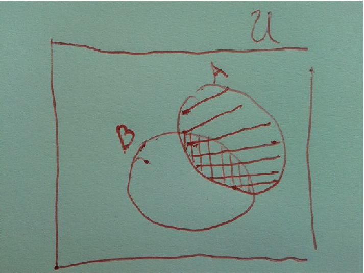
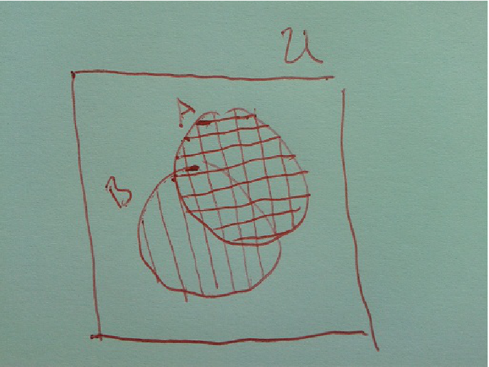
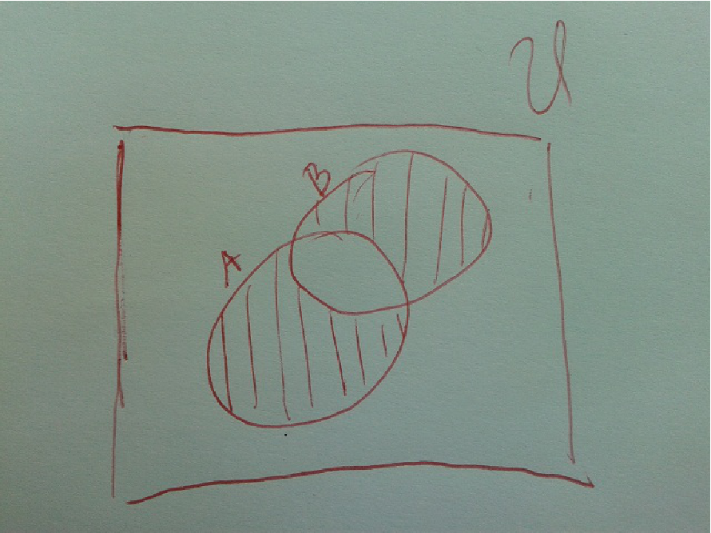
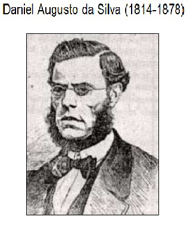
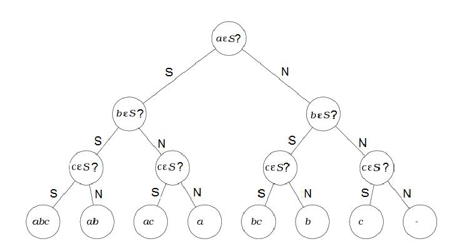
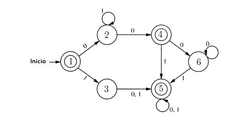
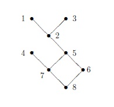
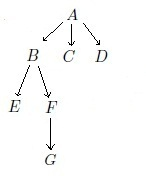

Capítulo 5: Teoria de Conjuntos
======

 A Teoria de Conjuntos é a teoria matemática que se ocupa dum universo $U$ de
indivíduos a que chamamos conjuntos. Diz-se que os objecto $a$ e $A$
existem e são conjuntos, se pertencem ao domínio $U$. Vamos supor que se
verificam  certas relações fundamentais, da forma $a\in A$, entre
objectos $a$ e $A$ do domínio $U$. Se para dois objectos $a$ e $A$ vale a
relação $a\in A$, diremos que ''$a$ é um elemento de $A$'' ou que ''$A$ contém
$a$ como elemento''. Um conjunto designa-se geralmente por uma letra maiúscula, reservando-se as letras minúsculas para os seus elementos. A negação de $x\in A$ representa-se simbolicamente por $x\not \in A$.

### Descrição
Um conjunto pode ser descrito em **extensão** (quando o número dos seus elementos for finito e suficientemente pequeno) enumerando explicitamente todos os seus elementos e colocados entre chavetas e separados por vírgulas ou em **compreensão**, enunciando uma propriedade caracterizadora dos seus elementos (isto é, uma propriedade que os seus e só os seus elementos possuem).

#### Exemplo:
Conjunto das vogais $V$ é descrito em extensão $V=\{a,e,i,o,u\}$;


#### Exemplo:
Conjunto $L$ das palavras da lingua portuguesa escritas com 5 letras vogais, está descrito em compreensão;


#### Exemplo:
Conjunto dos números naturais pares pode ser descrito, em compreensão, como sendo definido por naturais $n$ para os quais existe um natural $q$ tal que $n=2q$.

#### Exemplo:
$1\in \{1,2,3\},\;\; 2 \in \{4,2,5\},\;\;7\not\in\{1,2,3\},\;\;\{1\}\not\in \{1,2,3\}$

#### Exemplo:
$1\in\{n:\; n \text{ é um natural ímpar}\}\;\;2\not\in\{n:\; n \text{ é um natural ímpar}\}$

### Axioma da extensão
Dois conjuntos $A$ e $B$ são iguais se e só se têm os mesmos
elementos. Neste caso escrevemos, $A=B$.

Simbolicamente temos $$A=B\Leftrightarrow \forall x(x\in A \leftrightarrow x\in B)$$
Dada uma expressão proposicional $P(x)$ (um predicado colectivizante), há um só conjunto
que tem por elementos os $x$ que satisfazem $P(x)$, tal conjunto
será denotado por $$\{x:P(x)\}.$$

#### Exemplo:
1. $\{1,2,3,4,5\} = \{5,4,1,2,3\}$ e $\{5,5,5,5\}=\{5\}$ porque os conjuntos envolvidos têm os mesmos elementos.
+ $\{1,2,3,4,5\} \neq \{5,4,2,3\}$ e $\{5,5,5,5\}\neq\{5,6\}$ porque os conjuntos envolvidos são definidos por elementos diferentes.


#### Proposição:
No domínio $U$ dos conjuntos temos a relação de igualdade de conjuntos satisfaz:
1. $\forall x(x=x)$ (reflexiva)
+ $\forall x\forall y(x=y\rightarrow y=x)$ (simétrica)
+ $\forall x\forall y\forall z(x=y \wedge y=z\rightarrow x=z)$

Quando não se quer ser tão formal, escrevemos de forma equivalente;

#### Proposição:
A relação de igualdade de conjuntos satisfaz, para todos os conjuntos $A$, $B$ e $C$:
1. $A=A$ (reflexiva)
+ $A=B \Rightarrow B=A$ (simétrica)
+ $A=B \wedge B=C\Rightarrow A=C$ (transitiva)

Enfraquecendo a relação de igualdade, diremos que $A$ é subconjunto de $B$ se todo o elemento de $A$ é um elemento de $B$, que podemos traduzir simbolicamente escrevendo:

$$A\subseteq B \Leftrightarrow \forall x (x\in A \rightarrow x\in B)$$

#### Exemplo
Se $A=\{\{1\},2,3\}$, então $\{1\}\in A$, $\{\{1\},2\}\subseteq A$, $2\in A$, $\{2,3\}\subseteq A$.

Com esta definição pode enunciar-se que para conjuntos $A$ e $B$:

"$A\subseteq  B$ e $B \subseteq A$ se e só se  $A = B$."

Propriedade que podemos demonstrar, recorrendo às propriedades da lógica proposicional:

$$A\subseteq  B \wedge B \subseteq A$$
$$\Leftrightarrow$$ 
$$\forall x (x\in A \rightarrow x\in B)\wedge\forall x (x\in B \rightarrow x\in A)$$
$$\Leftrightarrow$$ 
$$\forall x ((x\in A \rightarrow x\in B)\wedge (x\in B \rightarrow x\in A))$$ 
$$\Leftrightarrow$$ 
$$\forall x (x\in A \leftrightarrow x\in B)$$ 
$$\Leftrightarrow$$
$$A = B$$ 
   
De forma idêntica pode-se demonstrar a veracidade de cada uma das afirmações apresentadas na proposição abaixo:

#### Proposição
No domínio $U$ dos conjuntos valem para a relação de inclusão:

1. $\forall x(x\subseteq x)$ (reflexiva)
- $\forall x\forall y(x\subseteq y\wedge y\subseteq x \rightarrow y=x)$ (anti-simétrica)
- $\forall x\forall y\forall z(x\subseteq y \wedge y\subseteq z\rightarrow x\subseteq z)$(transitiva)

Para conjuntos $A$, $B$ e $C$ valem:

1. $A\subseteq A$ (reflexiva)
- $(A\subseteq B\wedge B\subseteq A) \Rightarrow A=B$ (anti-simétrica)
- $(A\subseteq B \wedge B\subseteq C) \Rightarrow A\subseteq C$ (transitiva)


## Axioma dos conjuntos elementares

Assumimos que no universo dos conjuntos existe um conjunto que não contém qualquer elemento, que denotamos por $\emptyset$, e que designamos de conjunto vazio. Se $a$ é um
conjunto, existe um conjunto que contém apenas o elemento $a$, que representamos em extensão por $\{a\}$, e que designamos de \textbf{conjunto singular}. Se $a$ e $b$ são conjuntos existe um conjunto que contém $a$ e $b$, e apenas $a$ e $b$ como elementos, que representamos em extensão por $\{a,b\}$, que designamos de par não ordenado.

## Esquema da separação

m predicado $P(x)$ diz-se colectivizante se define um conjunto. Se $P(x)$ é colectivizante, para cada conjunto
$A$ existe um conjunto cujos elementos são precisamente os elementos $a$ de $A$ para os quais $P(a)$ é verdadeira.


Isto é, para cada expressão proposicional colectivizante $P(x)$ e cada conjunto $A$, a fórmula $$x\in A \wedge P(x),$$ define um conjunto. Assegura-se assim que existe um conjunto definido pela expressão:$$\{x:x\in A \wedge P(x)\} \text{ ou }\{x\in A:P(x)\}$$

Assegurando-se assim a existência da intersecção de dois conjuntos $A$ e $B$,
  $$A\cap B=\{x:x\in A\wedge x\in B\}$$

#### Proposição:
Para conjuntos $A,B$ e $C$ valem
1. $A\cap A=A$ (idempotência)
- $A\cap \emptyset = \emptyset$
- $A\cap B=B \cap A$ (comutatividade)
- $(A\cap B)\cap C=A \cap( B\cap C)$ (transitividade)
- $(C\subseteq A\wedge C\subseteq B)\Rightarrow C\subseteq A\cap B$
- $A\subseteq B \Leftrightarrow A\cap B= A$

#### Definição: [Conjuntos Disjuntos]
Dois conjuntos $A$ e $B$ são disjuntos se e só se $A\cap B = \emptyset$, ou seja se não têm elementos em comum.

#### Exemplo:
Se $A_1=\{\{1,2\},\{3\}\}$, $A_2=\{\{1\},\{2,3\}\}$ e $A_3=\{\{1,2,3\}\}$, os conjuntos $A_1,A_2,A_3$ são disjuntos dois a dois, já que $A_1\cap A_2=\emptyset$, $A_1\cap A_3=\emptyset$ e $A_1\cap A_3=\emptyset$.


## Axioma da união

Dado um conjunto $F$, existe um conjunto cujos elementos são os elementos dos elementos de $F$.
Este conjunto chama-se \textbf{união de} $F$ e denota-se por $$\bigcup_{A\in F}A.$$

#### Exemplo:
Dado o conjunto $$F=\{\{a,b\},\{a,b,c\},\{d\}\},$$ pelo axioma da união existe o conjunto
$$\bigcup_{A\in F}A=\{a,b,c,d\}.$$

Isto garante a existência do conjunto $$A\cup B=\{x: x\in A \vee y\in B\}$$ a união de $A$ e $B$.

#### Exemplo:
Dado o conjunto $$F=\{\{a,b\},\{a,b,c\},\{d\}\},$$ podemos assim escrever
$$\bigcup_{A\in F}A=\{a,b\}\bigcup \{a,b,c\}\bigcup \{d\}=\{a,b,c,d\}.$$


#### Exemplo:
Para $S=\{a,b,c,d\}$ e $Q=\{c,d,g,h\}$, temos $S\cup Q=\{a,b,c,d,g,h\}$ e $S\cap Q=\{c,d\}$.


#### Proposição:
Para conjuntos $A,B$ e $C$ temos:
1. $A\cup A= A$ (idempotência)
- $A\cup \emptyset = A$
- $A\cup B=B \cup A$ (comutatividade)
- $(A\cup B)\cup C=A \cup( B\cup C))$ (transitividade)
- $(A\subseteq C\wedge B\subseteq C) \Rightarrow A\cup B\subseteq C$
- $A\subseteq B \Leftrightarrow A\cup B= B$


Podemos ainda acrescentar as propriedades:

#### Proposição:
Para a união e intersecção de conjuntos temos:
\begin{enumerate}
1. $A\cup(B\cap C)=(A\cup B)\cap(A\cup C)$
- $A\cap(B\cup C)=(A\cap B)\cup(A\cap C)$
- $A\cup(A\cap B)=A$
- $A\cap(A\cup B)=A$
}

#### Dem.:
Apresentamos a demonstração de que $A\cup(B\cap C)=(A\cup B)\cap(A\cup C)$

$A\cup(B\cap C)$ =  $\{x:x\in A \vee x\in B\cap C\}$ 
=  $\{x:x\in A \vee (x\in B\wedge x\in C)\}$ 
=  $\{x:(x\in A \vee x\in B) \wedge (x\in A\vee x\in C)\}$ 
= $\{x:(x\in A \cup B) \wedge (x\in A\cup C)\}$ 
= $(A\cup B)\cap(A\cup C)$

Para calcular $A\cup(A\cap B)$ e $A\cap(A\cup B)$ podemos usar diagramas de Venn:




Temos assim $A\cup(A\cap B)=A$ e $A\cap(A\cup B)=A$.


A diferença entre dois conjuntos $A$ e $B$ ou o complementar de $B$ em $A$, $A-B$ ou $A\setminus B$, está definida e é o conjunto $$A\setminus B=\{x:x\in A \wedge x\notin B\}.$$

#### Exemplo:
Dados $A=\{2,5,6\}$, $B=\{3,4,2\}$ e $C=\{1,3,4\}$, temos $A\setminus B = \{5,6\}$, $B\setminus A = \{3,4\}$, e $A\setminus C = \{2,5,6\}$.


#### Exercício:
Mostre que para todo o par de conjuntos $A$ e $B$,
$$A\backslash(A\cap B) = A\backslash B.$$

Entendemos por \textbf{diferença simétrica} ou \textbf{soma booleana} entre dois conjuntos $A$ e $B$, ao conjunto $$A\oplus B=(A\setminus B)\cup(B\setminus A)=(A\cup B)\setminus (A\cap B).$$



As seguintes igualdades são valias:

$$A\oplus B=B\oplus A,\;\; A\oplus (B\oplus C)=(A\oplus B)\oplus C,\;\;A\oplus \emptyset=A$$

#### Exercício:
Mostre que para todo o conjunto $A$,
$$A\oplus \emptyset = A$$

## Axioma da potência

Dado um conjunto $A$, existe um conjunto cujos elementos são os subconjuntos de $A$. O conjunto cuja existência é decretada por este axioma, chama-se \textbf{conjunto potência} de $A$, ou \textbf{conjunto das partes} de $A$, que se denota por  $\mathcal{P}$, e representamos em compreensão por $$\mathcal{P}(A)=\{x:x\subseteq A\}.$$

#### Exemplo:
Temos assim:
1. $\mathcal{P}(\emptyset)=\{\emptyset\}$;
- $\mathcal{P}(\{\emptyset\})=\{\emptyset,\{\emptyset\}\}$;
- $\mathcal{P}(\{\emptyset,\{\emptyset\}\})=\{\emptyset,\{\emptyset\},\{\{\emptyset\}\},\{\emptyset,\{\emptyset\}\}\}$;
- $\mathcal{P}(\{0,1\})=\{\emptyset,\{0\},\{1\},\{0,1\}\}$.
- $\mathcal{P}(\{a,b,c\})=\{\emptyset,\{a\},\{b\},\{c\},\{a,b\},\{b,c\},\{a,c\},\{a,b,c\}\}$


## Cardinal dum conjunto

Seja $A$ um conjunto. Se o conjunto $A$ tem $n$ elementos, dizemos que $A$ é um \textbf{conjunto finito} e que o \textbf{cardinal} de $A$ é $n$. Neste caso escrevemos \[\sharp A=n \text{ ou } |A|=n.\]
Um conjunto $A$ diz-se \textbf{infinito} se não é finito.

#### Exemplo:
Assim
1. $|\emptyset|=0$;
- $|\{\emptyset\}|=1$;
- $|\{\emptyset,\{\emptyset\}\}|=2$.

#### Proposição: [Fórmula de Daniel da Silva]
Para conjuntos finitos $A$ e $B$ tem-se
$$|A\cup B|=|A|+|B|-|A\cap B|.$$




#### Proposição:
Se $A$ é um conjunto finito com $n$ elementos, então $|\mathcal{P}(A)|=2^n$.


Procuremos ilustrar este resultado através da árvore de decisão representada pelo diagrama abaixo.




O diagrama tem a seguinte interpretação: Se seleccionar um subconjunto $S$ de $\{a,b,c\}$. O circulo do topo, chamado nó, pode ser interpretado como sendo a pergunta: Está $a$ em $S$? Os dois arcos que saem dele têm como rótulos as duas respostas possíveis (Sim ou Não). Se seguirmos o arco com a resposta apropriada chegamos a um novo nó. Este nó codifica a próxima questão: O $b$ é um elemento de $S$? Seguindo o arco com a resposta certa chegamos a um novo nó. Que codifica a questão: O $c$ é um elemento de $S$? Escolhendo o arco com a resposta certa alcançamos a lista de elementos do conjunto $S$ seleccionado.

Assim, a construção dum subconjunto de $\{a,b,c\}$ corresponde a um percurso no diagrama partido do topo até à base. Existem assim tantos subconjuntos quanto o número de folhas no último nível (a base). Como o número de nós duplica de nível para nível, existem $2^3=8$ nós no último nível (caso a selecção seja feita num conjunto com $n$ elementos teríamos $2^n$ nós na árvore ou seja $2^n$ subconjuntos diferentes).

## Par ordenado

Só com os axiomas enunciados pode arquitectar-se
uma teoria de conjuntos satisfatória. Vamos exemplificar um pouco
da teoria com mais algumas definições e teoremas.
Dados dois conjuntos $a$ e $b$, o axioma dos conjuntos elementares garante a existência do
conjunto
$$\{\{a\},\{a,b\}\},$$
a que se chama \textbf{par ordenado} de coordenadas $a$ e $b$ e que
denotamos por $$(a,b).$$
Com base nos axiomas e definições que apresentámos é fácil
demonstrar que
$$(a,b)=(c,d)\Leftrightarrow a=c\wedge b=d.$$
Dados dois conjuntos $A$ e $B$, existe um conjunto cujos
elementos são precisamente todos os pares ordenados $(a,b)$, com $a\in A$ e
$b\in B$, designado de \textit{produto cartsiano} de $A$ por $B$ e que se denota por $$A\times B,$$ i.e. define-se
$$A\times B=\{(a,b):a\in A\wedge b\in B\}.$$
Adoptando-se as seguintes convenções 
$$A^2=A\times A,$$ 
$$A^3=A^2\times A,$$
$$\ldots$$
$$A^n=A^{n-1}\times A.$$
Naturalmente, que se tem:

#### Proposição:
Se $A$ e $B$ são conjuntos finitos com $|A|=n$ e $|B|=m$, então $$|A\times
B|=n\times m.$$


#### Exemplo:
Se $A=\{\alpha,\beta\}$ e $B=\{1,2,3\}$ tem-se

1. $A\times B = \{(\alpha,1),(\alpha,2),(\alpha,3),(\beta,1),(\beta,2),(\beta,3)\}$
- $B\times A = \{(1,\alpha),(2,\alpha),(3,\alpha),(1,\beta),(2,\beta),(3,\beta)\}$
- $A\times A = \{(\alpha,\alpha),(\alpha,\beta),(\beta,\alpha),(\beta,\beta)\}$
- $B\times B = \{(1,1),(1,2),(1,3),(2,1),(2,2),(2,3),(3,1),(3,2),(3,3)\}$

Para três conjuntos $A,B,C$ temos
$$A\times(B\cup C)=(A\times B)\cup (A\times C)$$
$$A\times(B\cap C)=(A\times B)\cap (A\times C)$$

#### Exercício:
Mostre que, para conjuntos $A,B,C$, $A\times(B\cup C)=(A\times B)\cup (A\times C)$


#### Definição:
Dois conjuntos $A$ e $B$ são disjuntos se e só se $A\cap B = \emptyset$. Um conjunto de conjuntos é definido por conjuntos disjuntos, se os conjuntos no conjunto são disjuntos dois a dois.


#### Exemplo:
O conjunto de conjuntos $F=\{\{1,3\},\{2,4,5\},\{0,6,7\}\}$, é definida por conjuntos disjuntos dois a dois, já que
$\{1,3\}\cap\{2,4,5\}=\emptyset$, $\{1,3\}\cap\{2,4,5\}=\emptyset$ e $\{2,4,5\}\cap\{0,6,7\}=\emptyset$. Neste caso dizemos que $F$ é uma partição $\{0,1,2,3,4,5,6,7\}$


#### Definição:
 A \textbf{diferença entre dois conjuntos} $A$ e $B$ (também designado \textbf{o complementar}
  de $B$ em $A$), que se denota por $A-B$ ou $A\setminus B$, está definida e é o conjunto $$A\setminus B=\{x:x\in A \wedge x\notin B\}.$$


Um conjunto $E$ diz-se \textbf{universal} se cotem todos os conjuntos em discussão. Neste sentido, para todo o conjunto $A$, $$A\subseteq E$$
ou dito de outra forma, para todo o predicado $P(x)$
$$ E=\{x: P(x)\vee \sim P(x)\}. $$
Por outro lado o conjunto que não cotem elementos é designado de conjunto vazio, ou seja, para todo o predicado $P(x)$ tem-se
$$\emptyset = \{x: P(x)\wedge \sim P(x)\}. $$
Neste sentido, para todo o conjunto $A$,
$$\emptyset\subseteq A \text{ já que } \forall x(x\in \emptyset \rightarrow x\in A)\text{ é uma proposição verdadeira.}$$

#### Definição:
Seja $E$ um conjunto universal. Para todo o conjunto $A$, o complemento de $A$ em $E$, $E-A$ é designado de \textbf{complemento do conjunto} $A$ e é denotado por $\overline{A}$. Neste sentido 
$$\overline{A}=\{x\in E:\sim x\in A\}=\{x:x\notin A\}.$$


#### Proposição [Leis de De Morgan] 
Para um conjunto universo valem as seguintes igualdades:
1. $\overline{A\cup B}=\overline{A}\cap \overline{B}$
- $\overline{A\cap B}=\overline{A}\cup \overline{B}$


#### Dem.:
A igualdade $\overline{A\cup B}=\overline{A}\cap \overline{B}$ pode ser demonstrada através

$\overline{A\cup B}$ = $\{x:\sim (x\in A\cup B)\}$ 
= $\{x:\sim (x\in A \vee x\in B)\}$ 
= $\{x:\sim (x\in A) \wedge \sim (x\in B)\}$
= $\{x:x\notin A \wedge x\notin B\}$ 
= $\{x:x\notin A\} \cap \{x:x\notin B\}$ 
= $\overline{A}\cap \overline{B}$ 

Assim definido tem-se $$A\setminus B=A\cap \overline{B}.$$

#### Definição:
Entendemos por \textbf{diferença simétrica} ou \textbf{soma booleana} entre dois conjuntos $A$ e $B$ ao
conjunto $$A\oplus B=(A\setminus B)\cup(B\setminus A)=(A\cup B)\setminus (A\cap B).$$

## Relação binária

Chama-se \textbf{relação binária} definida de $A$ para $B$ a qualquer subconjunto de $A\times B$. 
Diz-se \textbf{relação binária definida em} $A$ a qualquer subconjunto de $A^2=A\times A$.


Dada uma relação binária $R$
1. se $(a,b)\in R$ escrevemos $aRb$;
- se $(a,b)\notin R$ escrevemos $aR\!\!\!\!/b$;

Se $R$ é uma relação,  existe o conjunto, chamado \textbf{domínio} de $R$ e denotado
por $D(R)$, cujos elementos são os conjuntos $x$ para os quais
existe $y$ tal que $(x,y)\in R$, i.e.
$$D(R)=\{x:\exists y(xRy)\}.$$
De modo análogo, existe o \textbf{conjunto imagem} de $R$ dado por
$$Im(R)=\{y:\exists x(xRy)\}.$$

#### Exemplos:
Qualquer gráfico no plano define uma relação em $\mathbb{R}$. Em particular o gráfico que descreve o conjunto dos pares de reais $(x,y)$ solução da equação $x^2+y^2=1$, define a relação $$R=\{(x,y):x^2+y^2=1\}$$ em $\mathbb{R}$. Neste caso $0R1$, $1R0$, $-1R0$, mas $1R\!\!\!\!/1$. Temos ainda $D(R)=\{x:-1\leq x\leq 1\}$ e $Im(R)=\{y:-1\leq y\leq 1\}$.
\begin{center}
\includegraphics[width=100pt]{circle}
\end{center}


Caso o conjunto $A$ onde uma relação $R$ está definida, não tenha muitos elementos, a relação binária $R$ pode ser definida por:
1. Extensão enumerando os seus elementos;
- Um diagrama sagital (grafo orientado ou digrafo) representado por um diagrama de Venn do conjunto e traçando
  setas de $a$ para $b$ para todos os pares $aRb$;
- Uma tabela de dupla entrada (ou matriz da relação)
  colocando $V$, ou um $F$, no cruzamento da linha $a$ com a
  coluna $b$, respectivamente, se $aRb$ ou $aR\!\!\!\!/b$.

\begin{exam}
A relação $R$ definida no conjunto  $A=\{1,2,3,4\}$ em extensão por
  $R=\{(1,2),(1,3),(1,4),$ $(2,3),(2,4),(3,4)\}$
pode ser representada pelo diagrama sagital,
\begin{center}
\includegraphics[width=100pt]{fig1}
\end{center}
definida pela tabela de dupla entrada
\begin{center}
\begin{tabular}{|c|cccc|}
  \hline
  R & 1 & 2 & 3 & 4 \\
  \hline
  1 & F & V & V & V \\
  2 & F & F & V & V \\
  3 & F & F & F & V \\
  4 & F & F & F & F \\
  \hline
\end{tabular}
\end{center}
ou pela matriz
\[M_R=
\left[
  \begin{array}{cccc}
    0 & 1 & 1 & 1 \\
    0 & 0 & 1 & 1 \\
    0 & 0 & 0 & 1 \\
    0 & 0 & 0 & 0 \\
  \end{array}
\right]
\]
\end{exam}

\begin{exam}
Considere o conjunto $A=\{1,2,3\}$ a relação binária  $R$, definida por
\[xRy\Leftrightarrow x\leq y,\forall a,b\in A\]
pode ser definida:
\begin{enumerate}
  \item Por meio duma condição equivalente, por exemplo $\frac{y-x}{2}\geq 0$;
  \item Por extensão, por $R=\{(1,1),(1,2),(1,3),(2,2),(2,3),(3,3)\}$;
  \item Por um diagrama sagital:
\begin{center}
\includegraphics[width=100pt]{fig2}
\end{center}
  \item Por uma tabela de dupla entrada ou uma matriz de relação:
  \begin{center}
  \begin{tabular}{|c|ccc|}
    \hline
    R & 1 & 2 & 3 \\
    \hline
    1 & V & V & V \\
    2 & F & V & V \\
    3 & F & F & V \\
    \hline
  \end{tabular}
ou
$
M_R=\left[
  \begin{array}{ccc}
    1 & 1 & 1 \\
    0 & 1 & 1 \\
    0 & 0 & 1 \\
  \end{array}
\right]
$
  \end{center}
\end{enumerate}

\end{exam}


\section{Relação complementar} A relação complementar da relação binária $R$ em $A$, é a relação \[\R=A^2\backslash R \] que pode ser definida negando a condição que define $R$.

\begin{exam}
Seja $R$ a relação binária em $A=\{1,2,3\}$ dada por \[aRb\Leftrightarrow a\leq b,\forall a,b\in A.\]

Assim $ a\R b \Leftrightarrow \sim (a\leq b) \Leftrightarrow a>b,\forall a,b\in A$
ou seja $\R=\{(2,1),(3,1),(3,2)\}$ que tem por diagrama sagital
\begin{center}
\includegraphics[width=100pt]{fig3}
\end{center}
que podemos definir pela tabela

\begin{center}
  \begin{tabular}{|c|ccc|}
    \hline
    \R & 1 & 2 & 3 \\
    \hline
    1 & V & V & V \\
    2 & F & V & V \\
    3 & F & F & V \\
    \hline
  \end{tabular}
ou
$
M_{\R}=
\left[
  \begin{array}{ccc}
    1 & 1 & 1 \\
    0 & 1 & 1 \\
    0 & 0 & 1 \\
  \end{array}
\right]
$
\end{center}
\end{exam}

\begin{exam}
No conjunto $A=\{1,2,3\}$ a relação dada por $aRb \Leftrightarrow a = b,\forall a,b\in A$ é representada por
\begin{center}
\includegraphics[width=200pt]{fig4}
\end{center}
a relação complementar é dada por $a\R b \Leftrightarrow a \neq b,\forall a,b\in A$
e pode ser representada por
\begin{center}
\includegraphics[width=200pt]{fig5}
\end{center}
\end{exam}

Vamos classificar uma relação binária $R$, definida num conjunto $A$, sob três pontos de vista:
\begin{enumerate}
  \item Reflexividade
  \item Simetria
  \item Transitividade
\end{enumerate}

\section{Reflexividade}Uma relação binária $R$ definida no conjunto $A$ diz-se:
\begin{enumerate}
  \item \textbf{Reflexiva} se: $\forall x\in A: xRx$.
  \item \textbf{Não reflexiva} se: $\exists x\in A: x\R x$.
  \item \textbf{Anti-reflexiva} se: $\forall x,y\in A: xRy\rightarrow x\neq y$.
\end{enumerate}


\begin{exam}Exemplos de relações reflexivas no conjunto $A=\{1,2,3,4\}$
\begin{center}
\includegraphics[width=150pt]{fig6}
\includegraphics[width=150pt]{fig7}
\end{center}
\end{exam}
Note que, uma relação finita é reflexiva se no diagrama sagital cada ponto tem um laço, ou caso na matriz da relação todos os elementos da diagonal são 1.
\begin{exam}Exemplos de relações anti-reflexivas no conjunto $A=\{1,2,3\}$
\begin{center}
\includegraphics[width=150pt]{fig8}
\includegraphics[width=150pt]{fig9}
\end{center}
\end{exam}

\section{Simetria} Uma relação binária $R$ definida no conjunto $A$ diz-se:
\begin{enumerate}
  \item \textbf{Simétrica} se: $\forall x,y\in A: xRy\rightarrow yRx$.
  \item \textbf{Não simétrica} se: $\exists x,y\in A: xRy \wedge y\R x$.
  \item \textbf{Anti-simétrica} se: $\forall x,y\in A: xRy \wedge yRx \rightarrow x = y$.
\end{enumerate}

\begin{exam}Exemplos de relações simétricas no conjunto $A=\{1,2,3,4\}$
\begin{center}
\includegraphics[width=150pt]{fig10}
\includegraphics[width=150pt]{fig12}
\end{center}
\end{exam}
Note que, no diagrama sagital duma relação simétrica, sempre que existe uma seta de $x$ para $y$ temos também uma seta de $y$ para $x$.
Uma matriz $M_R$ representa uma relação simétrica se é simétrica.
\begin{center}
\includegraphics[width=150pt]{Asymmetric}
\includegraphics[width=150pt]{PartitionMatrixSym2}
\includegraphics[width=150pt]{h-mat}
\end{center}
\begin{exam}Exemplos de relações anti-simétricas no conjunto $A=\{1,2,3\}$
\begin{center}
\includegraphics[width=150pt]{fig13}
\includegraphics[width=150pt]{fig14}
\end{center}
\end{exam}

\section{Transitividade} Uma relação binária $R$ definida no conjunto $A$ diz-se:
\begin{enumerate}
  \item \textbf{Transitiva} se: $\forall x,y,z\in A: xRy \wedge yRz \rightarrow xRz$.
  \item \textbf{Não transitiva} se: $\exists x,y,z\in A: xRy \wedge yRz \wedge x\R z$.
\end{enumerate}

\begin{exam}Exemplos de relações transitivas no conjunto $A=\{1,2,3,4\}$
\begin{center}
\includegraphics[width=150pt]{fig15}
\includegraphics[width=150pt]{fig16}
\includegraphics[width=150pt]{fig17}
\end{center}
\end{exam}
\begin{exam}Exemplo duma relação não transitiva no conjunto $A=\{1,2,3,4\}$
\begin{center}
\includegraphics[width=150pt]{fig18}
\end{center}
\end{exam}

## Exercícios

Mostre que sempre que $f:A\rightarrow B$ e $g:B\rightarrow C$ são sobrejectivas, $g\circ f$ é sobrejectiva. 

Os conjuntos abaixo definem funções no conjunto $\{(2,3),(2,4),(3,2),(3,4),(1,4)\}$? Nesse caso, determine o seu domínio e classifique se são injectivas ou sobrejectivas.
  1. $\{(1,(2,3)),(2,(3,4)),(3,(1,4)),(4,(1,4))\}$
  - $\{(1,(2,3)),(2,(3,4)),(3,(3,2))\}$
  - $\{(1,(2,3)),(2,(3,4)),(1,(2,4))\}$
  - $\{(1,(2,3)),(2,(2,3)),(3,(2,3))\}$

Para duas relações de equivalência, no conjunto $A=\{0,1,2\}$, $R$ e $S$ definidas pelas matrizes
$M_S=\left[
       \begin{array}{ccc}
         1 & 1 & 0 \\
         1 & 1 & 0 \\
         0 & 0 & 1 \\
       \end{array}
     \right]$
 e 
$M_R=\left[
       \begin{array}{ccc}
         1 & 1 & 0 \\
         1 & 1 & 1 \\
         0 & 1 & 1 \\
       \end{array}
     \right].$
As relações $M_S\times M_R$ e $\{(a,b)\in A\times B: (b,a)\in S\}$ são também relações de equivalência?

Por $R$ representa-se a relação em $A=\{1,2,3,4,5,6\}$ tal que, $a R b$ se e só se, no autómato da Figura \ref{fig1} se pode transitar do estado $a$ para o estado $b$. Num autómato podemos transitar do estado $a$ para o estado $b$, sempre que existe um arco de $a$ para $b$. Por exemplo, no autómato da Figura \ref{fig1}, são verdade $2R2$,$2R4$,$2R6$ e $2R5$, mas é falso $2R3$ e $2R1$.
1. Justifique porque é que $(A,R)$ é um conjunto parcialmente ordenado.
- Apresente o diagrama de Hasse do conjunto parcialmente ordenado $(A,R)$.
- Determine os majorantes do conjunto $\{2,3,4\}$ relativamente à ordem parcial $R$ definida em $A$.
- O conjunto $\{2,3,4\}$ tem elemento mínimo? Justifique a resposta.

Considere o código em Python abaixo, que implementa uma função $$R(set,set)->set,$$ tal que $R(A,D)$ devolve uma relação em $A$, onde $D$ é também uma relação em $A$.
    def R(A,D):
        Rel = set()
        for x in A:
            A={(x,x)}
            B=set()
            while A!=B:
                B=set(A)
                for (a,b) in D:
                    if (x,a) in A and not (x,b) in A:
                        A.add((x,b))
                Rel=Rel|A
        return Rel
1. Para $A=\{1,2,3,4\}$ e $D=\{(1,2),(1,3),(3,4)\}$. Determine os pares que definem a relação que resulta da execução de:

    \>\>\> R(A,D)
    
- Como interpreta o resultado da função, quando aplicada à relação $D$ entre estados definida pelos arcos do autómato da Figura \ref{fig1}.


\caption{Diagrama de estados}\label{fig1}

Considere o conjunto $X=\{1,2,3,4,5,6,7,8\}$ parcialmente ordenado de acordo com o seguinte diagrama de Hasse.

 

Considere ainda os subconjuntos $A=\{3,4,7\}$ e $B=\{2,3,4,5\}$. Determine caso existam:
1. Os elementos maximais, minimais, máximo e mínimo de $X$.
- Os majorantes, minorantes, supremo e ínfimo de $A$ e $B$.

Mostre que, $n^2+n$ é par, para todo o inteiro $n\geq 0$.

Mostre que, $1+2+4+8\cdots+2^{n-1}=2^n-1$, para todo o inteiro $n\geq 1$.

Mostre que, $\sum_{k=1}^nk2^k=(n-1)2^{n+1}+2$, para todo $n \geq 1$

Considere a seguinte função definida por recorrência:

    def mdc(a,b):  # onde a <= b
        if a== 0:
            return b
        else:
            mdc(b,a%b)
 Calcule o valor devolvido pela função, para $mdc(4,155)$, justificando a resposta.


```python

```

Considere a seguinte função definida por recorrência:

    def f(n):
        if n == 0:
            return 0
        elif n == 1:
            return 1
        else:
            return f(n-1)+f(n-2)
            
1. Calcule o valor devolvido pela função, para $f(4)$, justificando a resposta.
- Mostre por indução que $f(1)+f(3)+\cdots+f(2n-1)=f(2n)$, para todo o inteiro $n>0$.

O dicionário abaixo representa uma árvore.

    G={'A':['',{'B','C','D'}],
       'B':['A',{'E','F'}],
       'C':['A',set()],
       'D':['A',set()],
       'E':['B',set()],
       'F':['B',{'G'}],
       'G':['F',set()]
       }

As chaves de $G$ definem os rótulos dos vértices da árvore. Por 'B':['A',\{'E','F'\}]  descrevemos que B está ligado a A, E e F. Neste caso, dizemos que A é o pai de B e que E e F são filhos de B. Por 'A':['',\{'B','C','D'\}]  identifica-se A como não tendo pai e por 'G':['F',set()] identifica-se G como não tendo  filhos. Numa árvore um vértice sem \emph{pai} diz-se a raiz da árvore. Um vértice sem filhos diz-se uma folha.

A árvore descrita pelo dicionário $G$ pode assumir a representação abaixo.

 

Considere a função c(dict,str)-> set definida por:

    def c(G,v):
        A={v}
        B=set()
        L=set()
        while A != B:
            B = set(A)
            print A
            for v in B:
                for x in G[v][1]:
                    if not x in A:
                        if len(G[x][1])== 0:
                            L.add(x)
                        else:
                            A.add(x)
        return L

1. Apresente o output da função print, quando da execução de c(G,'B'), onde G é o dicionário anterior.
- Qual é o resultado de executar c(G,'B'), onde G é o dicionário anterior?
- Descreva uma interpretação para o resultado da função c(G,v), quando executada para uma árvore G e um vértice v.

O dicionário

    D ={1:[2,3], 2:[4], 3:[4], 4:[6,5], 5:[7], 6:[7],7:[]}

representa o diagrama de Hasse, de uma ordem parcial no conjunto $\{1,2,3,4,5,6,7\}$, onde por exemplo, 1:[2,3] codifica que $1\leq 2$ e $1\leq 3$. Considere a função $sup(dict,int)-> set$ definida por:

    def sup(D,x):
        aux=set()
        for el in D[x]:
            aux = aux | sup(D,el)
        return set(D[x])| aux

1. Apresente a representação gráfica da relação descrita no dicionário $D$, através de um diagrama de Hasse.
- Qual é o resultado de executar \emph{sup(D,3)}, onde \emph{D} é o dicionário anterior?

Dada uma relação $R$, no conjunto $A=\{0,1,\ldots,n-1\}$, escreva em Python três funções:
1. L(set)->set que devolve o conjunto $L(R)=\{a:aRa\}.$ 
- S(set,int)->set que devolve o conjunto $S(R,b)=\{a: aRb\}.$
- T(set,int,int)->set que devolve o conjunto $$T(R,a,b)=\{c: aRc \vee bRc\}.$$
- e(set)->bool tal que $e(R)$, se a relação $R$ representa um grafo $G$, não orientado conexo, devolve True se e só se $G$ tem um caminho de Euler.

Dada uma relação $R$, no conjunto $A=\{0,1,\ldots,n-1\}$, escreva em Python três funções:
1. S(set)->set que devolve o conjunto $$S(R)=\{a:\exists b \in A, aRb \wedge bRa\}.$$
- t(set,int,int)->bool tal que $t(R,a,b)$ devolve True se e só se para $R^\ast$, o fecho transitivo de $R$, existe um elemento $c$ em $A$ tal que $aR^\ast c$ e $bR^\ast c$.


```python

```
